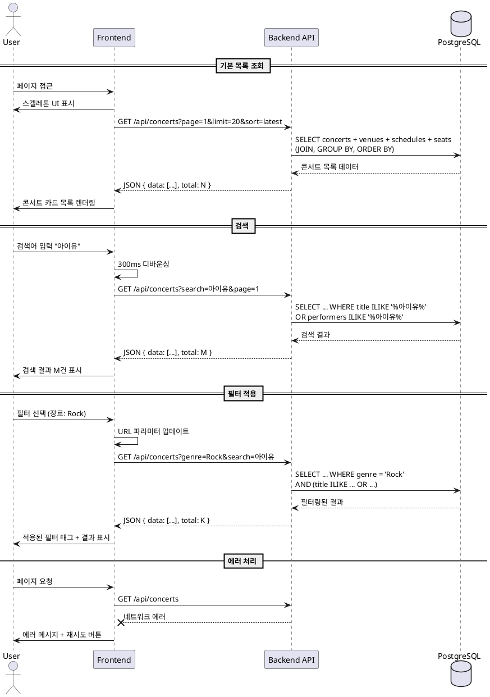

# UC-001: 콘서트 목록 조회 및 검색

## 1. 개요
- **유스케이스 ID**: UC-001
- **유스케이스명**: 콘서트 목록 조회 및 검색
- **Primary Actor**: 일반 사용자
- **관련 페이지**: `/` (홈), `/concerts` (콘서트 목록)

---

## 2. Precondition
- 사용자가 웹사이트에 접속 가능한 상태
- 시스템에 조회 가능한 콘서트 데이터가 존재 (비어있을 수 있음)

---

## 3. Trigger
- 사용자가 홈페이지 또는 콘서트 목록 페이지에 접근
- 검색창에 키워드 입력
- 필터 또는 정렬 옵션 변경

---

## 4. Main Scenario

### 4.1 기본 목록 조회
1. 사용자가 페이지에 접근
2. FE는 스켈레톤 UI를 표시
3. FE는 기본 파라미터로 API 요청 (정렬: 최신순, 페이지: 1, 페이지당: 20)
4. BE는 concerts 테이블과 관련 테이블을 조인하여 데이터 조회
5. BE는 결과를 JSON으로 응답 (콘서트 목록, 총 개수)
6. FE는 콘서트 카드 목록을 렌더링 (포스터, 제목, 장소, 날짜, 최저가)

### 4.2 검색
1. 사용자가 검색창에 키워드 입력
2. FE는 입력을 300ms 디바운싱 처리
3. FE는 검색 쿼리와 함께 API 요청
4. BE는 `title` 또는 `performers` 필드에서 ILIKE 검색 (pg_trgm 인덱스 활용)
5. BE는 검색 결과를 응답
6. FE는 검색 결과 건수와 함께 목록 표시

### 4.3 필터 적용
1. 사용자가 필터 옵션 선택 (장르, 날짜 범위, 지역, 가격대)
2. FE는 선택된 필터를 URL 파라미터에 반영
3. FE는 필터 조건과 함께 API 요청
4. BE는 WHERE 절에 필터 조건 추가하여 조회
5. BE는 필터링된 결과 응답
6. FE는 적용된 필터 태그와 함께 목록 표시

### 4.4 정렬
1. 사용자가 정렬 옵션 선택 (최신순, 인기순, 가격순)
2. FE는 현재 검색/필터 조건을 유지하며 정렬만 변경
3. FE는 정렬 파라미터와 함께 API 요청
4. BE는 ORDER BY 절에 정렬 조건 적용하여 조회
5. BE는 정렬된 결과 응답
6. FE는 정렬된 목록 표시

### 4.5 페이지네이션/무한 스크롤
1. 사용자가 스크롤하거나 페이지 버튼 클릭
2. FE는 다음 페이지 번호와 함께 API 요청
3. BE는 OFFSET과 LIMIT을 적용하여 다음 페이지 조회
4. BE는 다음 페이지 데이터 응답
5. FE는 기존 목록에 추가(무한 스크롤) 또는 교체(페이지네이션)

---

## 5. Edge Cases

### 5.1 검색 결과 없음
- **조건**: 검색 쿼리에 매칭되는 콘서트가 없음
- **처리**: 빈 상태 메시지와 필터 초기화 버튼 표시

### 5.2 네트워크 에러
- **조건**: API 요청 중 네트워크 연결 끊김
- **처리**: 에러 메시지와 재시도 버튼 표시

### 5.3 API 타임아웃
- **조건**: API 응답 시간이 10초 초과
- **처리**: 타임아웃 안내와 재시도 옵션 제공

### 5.4 중복 요청
- **조건**: 사용자가 빠르게 필터를 여러 번 변경
- **처리**: 진행 중인 요청 취소, 마지막 요청만 실행

### 5.5 URL 파라미터 복원
- **조건**: 페이지 새로고침 또는 북마크로 접근
- **처리**: URL 파라미터를 파싱하여 검색/필터 상태 복원

---

## 6. Business Rules

### BR-001: 검색 범위
- 검색은 콘서트 제목(`title`)과 출연진(`performers`) 필드에서만 수행
- 대소문자 구분 없이 부분 일치 검색

### BR-002: 필터 조합
- 모든 필터는 AND 조건으로 결합
- 필터 미선택 시 해당 조건 무시

### BR-003: 삭제된 콘서트 제외
- `is_deleted = FALSE`인 콘서트만 조회
- `status = 'active'`인 콘서트만 표시

### BR-004: 페이지네이션 크기
- 기본 페이지당 20개 항목
- 최대 100개까지 조정 가능 (파라미터로 제한)

### BR-005: 최저가 계산
- 해당 콘서트의 모든 회차, 모든 좌석 중 최저가를 표시
- 가격이 없는 경우 "가격 미정" 표시

---

## 7. PlantUML Sequence Diagram

---

**문서 버전**: 1.0
**작성일**: 2025-10-16
