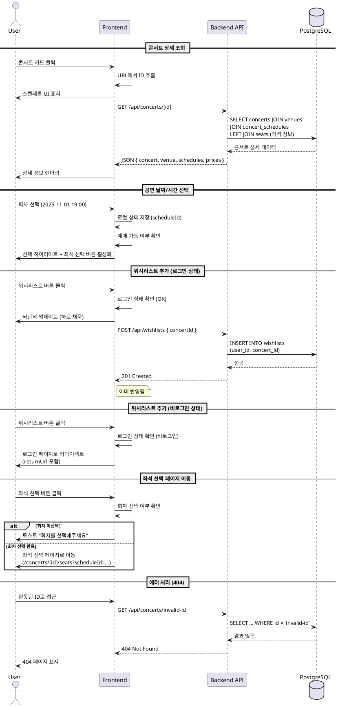

# UC-002: 콘서트 상세 조회

## 1. 개요
- **유스케이스 ID**: UC-002
- **유스케이스명**: 콘서트 상세 조회
- **Primary Actor**: 일반 사용자
- **관련 페이지**: `/concerts/[id]` (콘서트 상세)

---

## 2. Precondition
- 사용자가 웹사이트에 접속 가능한 상태
- 조회하려는 콘서트 ID가 존재 (URL 파라미터 또는 링크 클릭)

---

## 3. Trigger
- 사용자가 콘서트 목록에서 특정 콘서트 카드 클릭
- 직접 URL로 콘서트 상세 페이지 접근
- 위시리스트 추가/제거 버튼 클릭
- 공연 날짜/시간 선택
- 좌석 선택 버튼 클릭

---

## 4. Main Scenario

### 4.1 콘서트 상세 정보 조회
1. 사용자가 콘서트 카드 클릭 또는 직접 URL 접근
2. FE는 URL에서 콘서트 ID 추출
3. FE는 스켈레톤 UI 표시
4. FE는 콘서트 상세 API 요청 (GET `/api/concerts/[id]`)
5. BE는 concerts 테이블과 venues, concert_schedules 조인하여 조회
6. BE는 콘서트 기본 정보, 공연장 정보, 회차 목록, 가격 정보 응답
7. FE는 상세 정보를 렌더링 (포스터, 제목, 출연진, 날짜/시간 목록, 가격표)

### 4.2 공연 날짜/시간 선택
1. 사용자가 여러 회차 중 특정 날짜/시간 선택
2. FE는 선택된 회차 ID를 로컬 상태에 저장
3. FE는 해당 회차의 예매 가능 여부 확인 (`is_sold_out`, `is_booking_open`)
4. 매진된 회차는 선택 불가 상태로 표시
5. 선택 완료 시 좌석 선택 버튼 활성화

### 4.3 위시리스트 추가/제거
1. 사용자가 위시리스트 버튼 클릭
2. FE는 로그인 상태 확인
3. **비로그인**: 로그인 페이지로 리다이렉트 (현재 페이지 URL 저장)
4. **로그인**: FE는 위시리스트 추가/제거 API 요청 (POST/DELETE `/api/wishlists`)
5. FE는 낙관적 업데이트로 즉시 UI 반영 (하트 아이콘 토글)
6. BE는 wishlists 테이블에 INSERT 또는 DELETE 실행
7. BE는 성공 응답
8. API 실패 시: FE는 이전 상태로 롤백 및 에러 토스트 표시

### 4.4 좌석 선택 페이지로 이동
1. 사용자가 좌석 선택 버튼 클릭
2. FE는 공연 날짜/시간 선택 여부 확인
3. **미선택**: 회차 선택 안내 토스트 표시
4. **선택 완료**: FE는 선택된 회차 ID와 함께 좌석 선택 페이지로 이동 (`/concerts/[id]/seats?scheduleId=[scheduleId]`)

---

## 5. Edge Cases

### 5.1 유효하지 않은 콘서트 ID
- **조건**: URL의 ID가 존재하지 않거나 형식이 잘못됨
- **처리**: 404 페이지 표시

### 5.2 삭제된 콘서트
- **조건**: `is_deleted = TRUE` 또는 `status = 'cancelled'`
- **처리**: 안내 메시지 표시 및 콘서트 목록으로 리다이렉트

### 5.3 모든 회차 매진
- **조건**: 모든 concert_schedules의 `is_sold_out = TRUE`
- **처리**: "매진" 배지 표시, 좌석 선택 버튼 비활성화

### 5.4 예매 오픈 전
- **조건**: 모든 concert_schedules의 `is_booking_open = FALSE`
- **처리**: 오픈 일시 안내 및 위시리스트 추가 유도

### 5.5 비로그인 상태 위시리스트 시도
- **조건**: 위시리스트 버튼 클릭 시 미인증 상태
- **처리**: 로그인 페이지로 리다이렉트 (현재 페이지 저장)

### 5.6 네트워크 에러
- **조건**: API 요청 중 네트워크 연결 끊김
- **처리**: 에러 메시지와 재시도 버튼 표시

### 5.7 포스터 이미지 로드 실패
- **조건**: `poster_url`이 없거나 이미지 로드 실패
- **처리**: 대체 placeholder 이미지 표시

---

## 6. Business Rules

### BR-001: 위시리스트 중복 방지
- 동일 사용자가 동일 콘서트를 중복 추가 불가
- `wishlists` 테이블의 UNIQUE 제약조건 (user_id, concert_id) 활용

### BR-002: 회차 선택 필수
- 좌석 선택 페이지 이동 전 반드시 회차 선택 필요
- 미선택 시 버튼 비활성화 또는 안내 메시지

### BR-003: 매진 회차 선택 불가
- `is_sold_out = TRUE`인 회차는 선택 불가 처리
- UI에서 비활성화 및 "매진" 배지 표시

### BR-004: 삭제된 콘서트 비표시
- `is_deleted = TRUE`인 콘서트는 404 처리
- 기존 URL 공유 시에도 접근 차단

### BR-005: 낙관적 업데이트
- 위시리스트 추가/제거는 즉시 UI 반영
- API 실패 시 롤백 처리

---

## 7. PlantUML Sequence Diagram

---

**문서 버전**: 1.0
**작성일**: 2025-10-16
