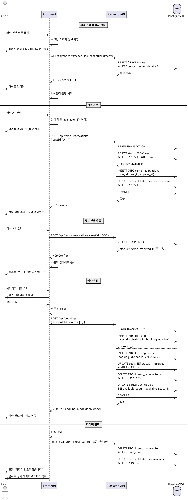

# UC-003: 좌석 선택 및 예약

## 1. 개요
- **유스케이스 ID**: UC-003
- **유스케이스명**: 좌석 선택 및 예약
- **Primary Actor**: 인증된 사용자
- **관련 페이지**: `/concerts/[id]/seats` (좌석 선택)

---

## 2. Precondition
- 사용자가 로그인된 상태
- 콘서트 ID와 회차 ID가 선택된 상태
- 선택한 회차가 예매 가능 상태 (`is_booking_open = TRUE`, `is_sold_out = FALSE`)

---

## 3. Trigger
- 사용자가 콘서트 상세 페이지에서 좌석 선택 버튼 클릭
- 개별 좌석 클릭 (선택/해제)
- 예약하기 버튼 클릭
- 타이머 만료 (10분)

---

## 4. Main Scenario

### 4.1 좌석 선택 페이지 진입
1. 사용자가 좌석 선택 버튼 클릭 (회차 선택 완료 상태)
2. FE는 로그인 상태 및 회차 정보 확인
3. FE는 좌석 선택 페이지로 이동
4. FE는 타이머 시작 (10분 카운트다운)
5. FE는 좌석도 API 요청 (GET `/api/concerts/schedules/[scheduleId]/seats`)
6. BE는 seats 테이블에서 해당 회차의 모든 좌석 조회
7. BE는 좌석 목록 응답 (좌석 번호, 등급, 가격, 상태, 좌표)
8. FE는 좌석도 렌더링 (상태별 색상 구분)
9. FE는 5초 간격으로 좌석 상태 폴링 시작 (실시간 동기화)

### 4.2 좌석 선택
1. 사용자가 선택 가능한 좌석 클릭
2. FE는 좌석 상태 확인 (`status = 'available'`)
3. FE는 현재 선택 좌석 수 확인 (최대 4석 제한)
4. **최대 초과**: 토스트 메시지 "최대 4석까지 선택 가능합니다"
5. **선택 가능**: FE는 임시 예약 API 요청 (POST `/api/temp-reservations`)
6. FE는 낙관적 업데이트 (좌석 색상 변경)
7. BE는 트랜잭션 시작
8. BE는 좌석 상태 확인 (FOR UPDATE 락)
9. **이미 예약됨**: BE는 409 Conflict 응답
10. **선택 가능**: BE는 temp_reservations 테이블에 INSERT (expires_at = NOW() + 10분)
11. BE는 seats 테이블의 status를 'temp_reserved'로 UPDATE
12. BE는 트랜잭션 커밋
13. BE는 성공 응답
14. FE는 선택 목록에 좌석 추가, 총 금액 업데이트

### 4.3 좌석 해제
1. 사용자가 선택된 좌석의 삭제 버튼 클릭
2. FE는 임시 예약 해제 API 요청 (DELETE `/api/temp-reservations/[seatId]`)
3. BE는 temp_reservations에서 해당 좌석 DELETE
4. BE는 seats의 status를 'available'로 UPDATE
5. BE는 성공 응답
6. FE는 선택 목록에서 제거, UI 업데이트

### 4.4 예약 생성
1. 사용자가 예약하기 버튼 클릭 (최소 1석 선택 상태)
2. FE는 최종 확인 다이얼로그 표시 (선택 좌석, 총 금액)
3. 사용자가 확인 버튼 클릭
4. FE는 버튼 비활성화 (중복 클릭 방지)
5. FE는 예약 생성 API 요청 (POST `/api/bookings`)
6. BE는 트랜잭션 시작
7. BE는 예약 번호 생성 (UUID 기반)
8. BE는 bookings 테이블에 INSERT
9. BE는 booking_seats 테이블에 선택된 좌석 매핑 INSERT
10. BE는 seats의 status를 'reserved'로 UPDATE
11. BE는 temp_reservations에서 해당 사용자의 임시 예약 DELETE
12. BE는 concert_schedules의 available_seats 감소, is_sold_out 업데이트
13. BE는 트랜잭션 커밋
14. BE는 예약 정보 응답 (booking_id, booking_number)
15. FE는 예약 완료 페이지로 리다이렉트 (`/my/bookings/[bookingId]`)

### 4.5 타이머 관리
1. FE는 매초 타이머 업데이트 (MM:SS 형식)
2. **3분 남음**: 주황색 경고 토스트 표시
3. **1분 남음**: 빨간색 강조 토스트 표시
4. **시간 만료**:
   - FE는 모든 임시 예약 해제 API 요청
   - FE는 안내 모달 표시 "시간이 만료되었습니다"
   - FE는 콘서트 상세 페이지로 리다이렉트

---

## 5. Edge Cases

### 5.1 비로그인 상태 접근
- **조건**: 미인증 상태에서 페이지 접근 시도
- **처리**: 로그인 페이지로 리다이렉트 (현재 경로 저장)

### 5.2 회차 정보 없음
- **조건**: URL에 scheduleId가 없거나 유효하지 않음
- **처리**: 콘서트 상세 페이지로 리다이렉트

### 5.3 동시 선택 충돌
- **조건**: 두 사용자가 동일 좌석을 동시에 선택
- **처리**: 먼저 요청한 사용자 우선, 나중 사용자는 409 에러 + 롤백 + 토스트 "이미 선택된 좌석입니다"

### 5.4 네트워크 끊김 중 타이머 만료
- **조건**: 오프라인 상태에서 타이머 만료
- **처리**: 재연결 시 서버에서 임시 예약 상태 확인, 만료 시 자동 해제 처리

### 5.5 페이지 새로고침
- **조건**: 좌석 선택 중 브라우저 새로고침
- **처리**: 서버에서 해당 사용자의 임시 예약 조회, 타이머 동기화 (expires_at 기준)

### 5.6 예약 생성 중 네트워크 끊김
- **조건**: POST `/api/bookings` 요청 중 연결 끊김
- **처리**: 재연결 시 예약 상태 확인 (중복 방지), 완료되었으면 해당 예약으로 이동

### 5.7 페이지 이탈 시도
- **조건**: 좌석 선택 중 뒤로가기 또는 브라우저 닫기
- **처리**: 확인 다이얼로그 표시, 확인 시 임시 예약 해제 API 호출 후 이탈

### 5.8 실시간 동기화 중 좌석 선점
- **조건**: 선택 시도 전에 다른 사용자가 해당 좌석 예약 완료
- **처리**: 5초 폴링으로 좌석 상태 업데이트, 자동으로 선택 불가 상태로 변경

---

## 6. Business Rules

### BR-001: 좌석 선택 제한
- 한 번에 최대 4석까지 선택 가능
- 초과 시도 시 에러 메시지 표시

### BR-002: 임시 예약 유효 시간
- 임시 예약은 생성 시점부터 정확히 10분간 유효
- 만료 시 자동 해제 (서버 측 cron job 또는 트리거)

### BR-003: 낙관적 락킹
- 좌석 선택 시 `FOR UPDATE` 락 사용
- 동시성 제어를 통한 이중 예약 방지

### BR-004: 예약 번호 생성 규칙
- UUID 기반 고유 예약 번호 생성
- QR코드 생성 시 이 번호 사용

### BR-005: 트랜잭션 원자성
- 예약 생성은 단일 트랜잭션으로 처리
- 일부 실패 시 전체 롤백

### BR-006: 실시간 동기화
- 5초 간격으로 좌석 상태 폴링
- 다른 사용자의 선택/예약 실시간 반영

---

## 7. PlantUML Sequence Diagram

---

**문서 버전**: 1.0
**작성일**: 2025-10-16
