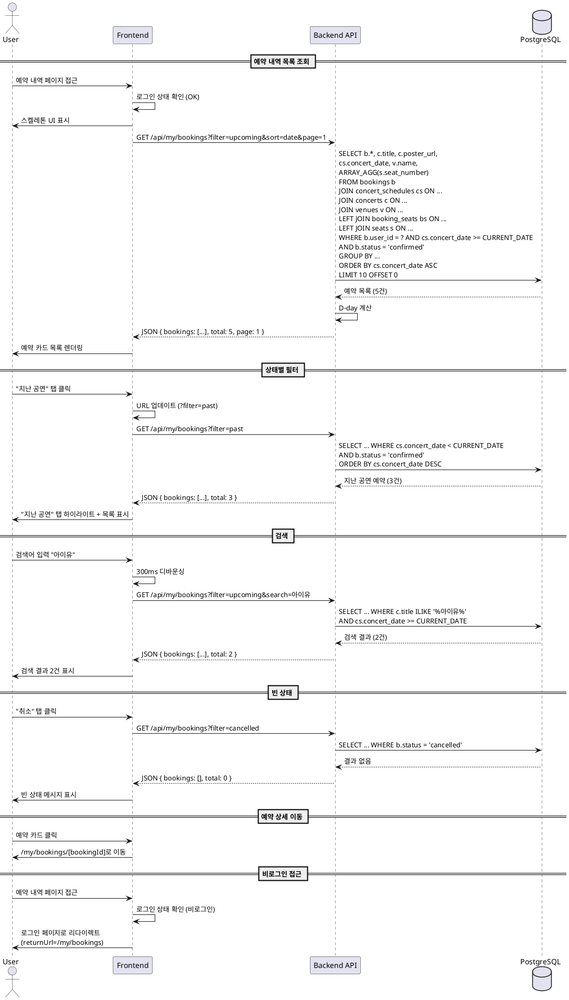

# UC-004: 예약 내역 조회

## 1. 개요
- **유스케이스 ID**: UC-004
- **유스케이스명**: 예약 내역 조회
- **Primary Actor**: 인증된 사용자
- **관련 페이지**: `/my/bookings` (예약 내역 목록)

---

## 2. Precondition
- 사용자가 로그인된 상태
- 사용자의 예약 내역 존재 여부 무관 (빈 상태 처리)

---

## 3. Trigger
- 사용자가 마이페이지 메뉴 클릭
- 예약 내역 페이지 접근
- 상태별 필터 선택 (예정/지난 공연/취소)
- 검색어 입력
- 정렬 옵션 변경

---

## 4. Main Scenario

### 4.1 예약 내역 목록 조회
1. 사용자가 예약 내역 페이지 접근 (`/my/bookings`)
2. FE는 로그인 상태 확인
3. **비로그인**: 로그인 페이지로 리다이렉트 (돌아올 경로 저장)
4. **로그인**: FE는 스켈레톤 UI 표시
5. FE는 예약 목록 API 요청 (GET `/api/my/bookings?filter=upcoming&sort=date&page=1`)
6. BE는 bookings 테이블에서 user_id로 예약 조회 (concerts, concert_schedules, seats 조인)
7. BE는 각 예약의 상태 계산:
   - 예정: `concert_date >= CURRENT_DATE AND status = 'confirmed'`
   - 지난 공연: `concert_date < CURRENT_DATE AND status = 'confirmed'`
   - 취소: `status = 'cancelled'`
8. BE는 D-day 계산 (예정된 공연의 경우)
9. BE는 페이지네이션 적용 (기본 10개/페이지)
10. BE는 예약 목록 응답 (콘서트 정보, 좌석 정보, 상태 포함)
11. FE는 예약 카드 목록 렌더링 (포스터, 제목, 날짜, D-day, 좌석 정보)

### 4.2 상태별 필터
1. 사용자가 상태 탭 선택 (예정/지난 공연/취소)
2. FE는 URL 파라미터 업데이트 (`?filter=upcoming`)
3. FE는 필터 조건과 함께 API 요청
4. BE는 WHERE 절에 날짜 및 상태 조건 추가
5. BE는 필터링된 결과 응답
6. FE는 선택된 탭 하이라이트 및 결과 렌더링
7. **결과 없음**: 빈 상태 메시지 표시

### 4.3 검색
1. 사용자가 검색창에 콘서트명 입력
2. FE는 입력을 300ms 디바운싱
3. FE는 검색어와 함께 API 요청
4. BE는 `concerts.title ILIKE '%검색어%'` 조건 추가
5. BE는 검색 결과 응답
6. FE는 검색 결과 건수와 함께 목록 표시
7. **결과 없음**: 빈 상태 및 검색 초기화 버튼 표시

### 4.4 정렬
1. 사용자가 정렬 옵션 선택 (날짜순/최신 예약순)
2. FE는 정렬 파라미터와 함께 API 요청
3. BE는 ORDER BY 절 적용:
   - 날짜순: `concert_date ASC` (예정) 또는 `concert_date DESC` (지난 공연)
   - 최신 예약순: `bookings.created_at DESC`
4. BE는 정렬된 결과 응답
5. FE는 정렬된 목록 렌더링

### 4.5 페이지네이션
1. 사용자가 스크롤 또는 더보기 버튼 클릭
2. FE는 다음 페이지 번호와 함께 API 요청
3. BE는 OFFSET/LIMIT 적용 (페이지당 10개)
4. BE는 다음 페이지 데이터 응답
5. FE는 기존 목록에 추가 또는 교체
6. **마지막 페이지**: 더보기 버튼 숨김

### 4.6 예약 상세 이동
1. 사용자가 예약 카드 클릭
2. FE는 예약 상세 페이지로 이동 (`/my/bookings/[bookingId]`)

---

## 5. Edge Cases

### 5.1 비로그인 상태 접근
- **조건**: 미인증 상태에서 페이지 접근
- **처리**: 로그인 페이지로 리다이렉트 (returnUrl 저장)

### 5.2 예약 내역 없음
- **조건**: 사용자의 예약 내역이 전혀 없음
- **처리**: 빈 상태 메시지 + "콘서트 둘러보기" 버튼 표시

### 5.3 모든 예약이 취소됨
- **조건**: 모든 예약의 status = 'cancelled'
- **처리**: "예정" 탭은 빈 상태, "취소" 탭에만 내역 표시

### 5.4 검색 결과 없음
- **조건**: 검색어에 매칭되는 예약 없음
- **처리**: 빈 상태 메시지 + 검색어 초기화 버튼

### 5.5 네트워크 에러
- **조건**: API 요청 중 연결 끊김
- **처리**: 에러 메시지 + 재시도 버튼 (캐시된 데이터가 있으면 오프라인 배지와 함께 표시)

### 5.6 페이지 새로고침
- **조건**: 브라우저 새로고침
- **처리**: URL 파라미터 기반으로 필터/정렬 상태 복원

### 5.7 삭제된 콘서트
- **조건**: 예약한 콘서트가 삭제됨 (`is_deleted = TRUE`)
- **처리**: 예약 정보는 유지, "공연 취소" 배지 표시

### 5.8 공연 시작 임박 (1시간 이내)
- **조건**: D-day 0, 공연 시작까지 1시간 이내
- **처리**: 강조 배지 표시 + 알림 토스트

---

## 6. Business Rules

### BR-001: 상태 자동 계산
- 예약 상태는 `concert_date`와 `bookings.status`를 기준으로 동적 계산
- 예정: `concert_date >= CURRENT_DATE AND status = 'confirmed'`
- 지난 공연: `concert_date < CURRENT_DATE AND status = 'confirmed'`
- 취소: `status = 'cancelled'` (날짜 무관)

### BR-002: D-day 계산
- D-day는 `concert_date - CURRENT_DATE` 일수로 계산
- D-0: 공연 당일
- 지난 공연은 D-day 표시 안 함

### BR-003: 페이지네이션 제한
- 기본 10개/페이지
- 최대 50개까지 조정 가능

### BR-004: 정렬 기본값
- 기본 필터: "예정" (`upcoming`)
- 기본 정렬: 날짜순 (가까운 순)

### BR-005: 검색 범위
- 검색은 콘서트 제목(`concerts.title`)에서만 수행
- 대소문자 구분 없음 (ILIKE)

---

## 7. PlantUML Sequence Diagram

---

**문서 버전**: 1.0
**작성일**: 2025-10-16
