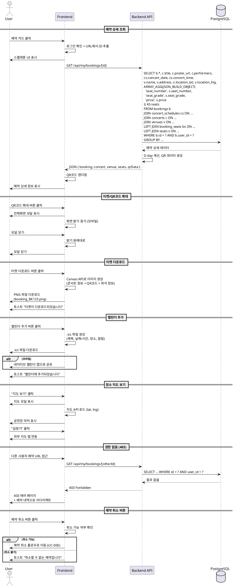

# UC-005: 예약 상세 조회

## 1. 개요
- **유스케이스 ID**: UC-005
- **유스케이스명**: 예약 상세 조회
- **Primary Actor**: 인증된 사용자 (예약 소유자)
- **관련 페이지**: `/my/bookings/[id]` (예약 상세)

---

## 2. Precondition
- 사용자가 로그인된 상태
- 조회하려는 예약이 존재하며, 현재 사용자가 소유
- 예약 ID가 URL에 포함

---

## 3. Trigger
- 사용자가 예약 내역 목록에서 예약 카드 클릭
- 직접 URL로 예약 상세 페이지 접근
- 티켓/QR코드 확대 버튼 클릭
- 티켓 다운로드 버튼 클릭
- 캘린더 추가 버튼 클릭
- 예약 취소 버튼 클릭

---

## 4. Main Scenario

### 4.1 예약 상세 정보 조회
1. 사용자가 예약 카드 클릭 또는 직접 URL 접근
2. FE는 로그인 상태 확인
3. **비로그인**: 로그인 페이지로 리다이렉트
4. **로그인**: FE는 URL에서 예약 ID 추출
5. FE는 스켈레톤 UI 표시
6. FE는 예약 상세 API 요청 (GET `/api/my/bookings/[id]`)
7. BE는 예약 ID로 상세 정보 조회 (bookings + concerts + concert_schedules + venues + seats 조인)
8. BE는 예약 소유자 확인 (`bookings.user_id = 현재 사용자`)
9. **소유자 불일치**: BE는 403 Forbidden 응답
10. **소유자 일치**: BE는 예약 정보, 콘서트 정보, 좌석 정보 응답
11. BE는 QR코드 데이터 포함 (booking_number 기반)
12. BE는 D-day 계산
13. FE는 상세 정보 렌더링 (포스터, 콘서트 정보, QR코드, 좌석 목록, 액션 버튼)

### 4.2 티켓/QR코드 확대
1. 사용자가 QR코드 확대 버튼 클릭
2. FE는 전체화면 모달 표시
3. FE는 QR코드를 고해상도로 렌더링 (예약 번호 기반)
4. **모바일**: FE는 화면 밝기 자동 증가 (Screen Wake Lock API)
5. 사용자가 모달 닫기 클릭
6. FE는 모달 닫기 및 밝기 원래대로 복원

### 4.3 티켓 다운로드
1. 사용자가 티켓 다운로드 버튼 클릭
2. FE는 티켓 이미지 생성 (콘서트 정보 + QR코드 + 예약 정보)
3. FE는 Canvas API로 이미지 렌더링
4. FE는 PNG 파일 다운로드 트리거 (`booking_[예약번호].png`)
5. **실패**: 에러 토스트 + 재시도 옵션
6. **성공**: 완료 토스트 표시

### 4.4 캘린더에 추가
1. 사용자가 캘린더 추가 버튼 클릭
2. FE는 .ics 파일 생성:
   - 제목: 콘서트명
   - 날짜/시간: 공연 시작 시간
   - 장소: 공연장 주소
   - 알림: 3시간 전
3. FE는 파일 다운로드 트리거 (`concert_[예약번호].ics`)
4. **모바일**: 네이티브 캘린더 앱으로 공유 인텐트
5. 완료 토스트 표시

### 4.5 장소 지도 보기
1. 사용자가 "지도 보기" 링크 클릭
2. FE는 지도 모달 표시
3. FE는 지도 API 로드 (Google Maps 또는 Kakao Map)
4. FE는 공연장 위치에 마커 표시 (location_lat, location_lng)
5. 사용자가 "길찾기" 버튼 클릭
6. FE는 외부 지도 앱으로 연동 (좌표 전달)

### 4.6 예약 취소 버튼 클릭
1. 사용자가 예약 취소 버튼 클릭
2. FE는 취소 가능 여부 확인:
   - `status = 'cancelled'`: 버튼 비활성화 (이미 취소됨)
   - `concert_date < CURRENT_DATE`: 취소 불가 (공연 종료)
   - 취소 가능 기간 확인 (예: 공연 시작 24시간 전까지)
3. **취소 가능**: 예약 취소 유스케이스(UC-006)로 이동

---

## 5. Edge Cases

### 5.1 유효하지 않은 예약 ID
- **조건**: URL의 ID가 존재하지 않음
- **처리**: 404 페이지 표시

### 5.2 다른 사용자의 예약 접근
- **조건**: 예약 소유자와 현재 사용자 불일치
- **처리**: 403 에러 페이지 + 예약 내역으로 리다이렉트

### 5.3 이미 취소된 예약
- **조건**: `status = 'cancelled'`
- **처리**: 취소 정보 섹션 표시 (취소 날짜, 사유), 취소 버튼 숨김

### 5.4 공연 종료 후 조회
- **조건**: `concert_date < CURRENT_DATE`
- **처리**: "지난 공연" 배지 표시, 예약 취소 버튼 비활성화

### 5.5 QR코드 생성 실패
- **조건**: QR 라이브러리 로드 실패 또는 데이터 오류
- **처리**: 예약 번호만 텍스트로 표시

### 5.6 티켓 다운로드 실패
- **조건**: Canvas API 지원 안 됨 또는 저장 공간 부족
- **처리**: 에러 토스트 + 스크린샷 안내

### 5.7 네트워크 끊김
- **조건**: API 요청 중 연결 끊김
- **처리**: 에러 메시지 + 재시도 버튼 (캐시된 데이터가 있으면 오프라인 배지와 함께 표시)

### 5.8 콘서트 취소/연기
- **조건**: `concerts.status = 'cancelled'` 또는 `'postponed'`
- **처리**: 특별 안내 배너 표시 + 고객센터 연락처

### 5.9 지도 API 로드 실패
- **조건**: 지도 API 키 오류 또는 네트워크 문제
- **처리**: 주소 텍스트만 표시 + 복사 버튼

---

## 6. Business Rules

### BR-001: 예약 소유자 확인
- 예약 상세는 반드시 소유자만 조회 가능
- 다른 사용자 접근 시 403 에러

### BR-002: QR코드 생성 규칙
- QR코드 데이터: `booking_number` (예: "BK-ABC123")
- QR 라이브러리: qrcode.react 또는 qrcode 사용

### BR-003: 취소 가능 기간
- 기본: 공연 시작 시간 24시간 전까지
- 공연 종료 후 또는 이미 취소된 예약은 불가

### BR-004: 티켓 파일 형식
- 티켓 이미지: PNG (Canvas API)
- 캘린더 파일: .ics (iCalendar 포맷)
- 파일명: `booking_[예약번호].[확장자]`

### BR-005: D-day 표시
- D-day는 `concert_date - CURRENT_DATE`
- D-0: 공연 당일
- 지난 공연: D-day 대신 "지난 공연" 배지

---

## 7. PlantUML Sequence Diagram

---

**문서 버전**: 1.0
**작성일**: 2025-10-16
