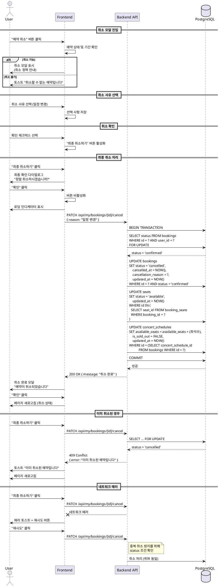

# UC-006: 예약 취소

## 1. 개요
- **유스케이스 ID**: UC-006
- **유스케이스명**: 예약 취소
- **Primary Actor**: 인증된 사용자 (예약 소유자)
- **관련 페이지**: `/my/bookings/[id]` (예약 상세 페이지 내 취소 모달)

---

## 2. Precondition
- 사용자가 로그인된 상태
- 예약이 존재하며 현재 사용자가 소유
- 예약 상태가 'confirmed' (확정됨)
- 공연 시작 시간 전 (취소 가능 기간 내)

---

## 3. Trigger
- 사용자가 예약 상세 페이지에서 예약 취소 버튼 클릭
- 취소 사유 선택
- 취소 확인 체크박스 선택
- 최종 취소하기 버튼 클릭

---

## 4. Main Scenario

### 4.1 취소 모달 진입
1. 사용자가 예약 상세 페이지에서 "예약 취소" 버튼 클릭
2. FE는 예약 상태 재확인:
   - `status = 'cancelled'`: 에러 토스트 "이미 취소된 예약입니다"
   - `concert_date < CURRENT_DATE`: 에러 토스트 "지난 공연은 취소할 수 없습니다"
   - 취소 가능 기간 확인 (공연 시작 24시간 전까지)
3. **취소 불가**: 안내 토스트 표시 및 모달 미표시
4. **취소 가능**: FE는 취소 모달 표시
5. FE는 취소 정책 안내 표시 (취소 가능 기간, 주의사항)

### 4.2 취소 사유 선택 (선택 사항)
1. FE는 취소 사유 목록 표시:
   - 일정 변경
   - 중복 예약
   - 가격 문제
   - 단순 변심
   - 기타
2. 사용자가 사유 선택 (선택 사항, 스킵 가능)
3. **"기타" 선택 시**: 텍스트 입력 필드 표시 (최대 500자)
4. 사용자가 상세 사유 입력

### 4.3 취소 확인 체크박스
1. FE는 필수 확인 사항 체크박스 표시:
   - "취소 정책을 확인했습니다"
   - "취소 후 복구할 수 없음을 이해했습니다"
2. 사용자가 체크박스 선택
3. **미체크 시**: "최종 취소하기" 버튼 비활성화
4. **체크 완료**: 버튼 활성화

### 4.4 최종 취소 처리
1. 사용자가 "최종 취소하기" 버튼 클릭
2. FE는 최종 확인 다이얼로그 표시:
   - "정말 예약을 취소하시겠습니까?"
   - "확인" / "돌아가기" 버튼
3. 사용자가 "확인" 클릭
4. FE는 버튼 비활성화 (중복 클릭 방지)
5. FE는 로딩 인디케이터 표시
6. FE는 예약 취소 API 요청 (PATCH `/api/my/bookings/[id]/cancel`)
   - Body: `{ reason: "선택 사유", reasonDetail: "상세 사유" }`
7. BE는 트랜잭션 시작
8. BE는 예약 상태 확인 및 권한 확인
9. BE는 `bookings` 테이블 UPDATE:
   - `status = 'cancelled'`
   - `cancelled_at = NOW()`
   - `cancellation_reason = 사유`
10. BE는 `seats` 테이블 UPDATE: `status = 'available'` (예약된 좌석 복원)
11. BE는 `concert_schedules` 테이블 UPDATE:
    - `available_seats` 증가 (취소된 좌석 수만큼)
    - `is_sold_out = FALSE`
12. BE는 트랜잭션 커밋
13. BE는 성공 응답
14. FE는 취소 완료 모달 표시:
    - "예약이 취소되었습니다"
    - 취소된 예약 번호
15. 사용자가 "확인" 클릭
16. FE는 예약 상세 페이지 새로고침 (취소 상태로 갱신)

---

## 5. Edge Cases

### 5.1 이미 취소된 예약
- **조건**: 다른 기기/탭에서 먼저 취소 처리됨
- **처리**: 409 Conflict 에러 + 페이지 새로고침 + 토스트 "이미 취소된 예약입니다"

### 5.2 취소 가능 기간 경과
- **조건**: API 요청 시점에 이미 취소 가능 기간 지남
- **처리**: 400 Bad Request + 토스트 "취소 가능 기간이 지났습니다"

### 5.3 네트워크 에러
- **조건**: API 요청 중 네트워크 연결 끊김
- **처리**: 에러 토스트 + 재시도 버튼 (중복 취소 방지 체크)

### 5.4 API 타임아웃
- **조건**: 서버 응답 시간 초과
- **처리**: 타임아웃 안내 + 재시도 옵션 + 재연결 시 취소 상태 확인 (중복 방지)

### 5.5 동시 취소 시도
- **조건**: 같은 예약을 동시에 여러 번 취소 요청
- **처리**: 첫 번째 요청만 성공, 나머지는 409 Conflict

### 5.6 모달 외부 클릭/ESC 키
- **조건**: 취소 진행 중 모달 닫기 시도
- **처리**:
  - 취소 처리 전: 모달 닫기
  - 취소 처리 중: 닫기 불가 + 로딩 상태 유지

### 5.7 공연 시작 임박 (1시간 이내)
- **조건**: 공연 시작까지 1시간 이내
- **처리**: 추가 경고 다이얼로그 표시 + 재확인 요구

### 5.8 콘서트 자체가 취소된 경우
- **조건**: `concerts.status = 'cancelled'`
- **처리**: 별도 안내 처리 (고객센터 연락 유도), 일반 취소 프로세스와 구분

---

## 6. Business Rules

### BR-001: 취소 가능 조건
- `bookings.status = 'confirmed'`
- `concert_date > CURRENT_DATE`
- 공연 시작 시간 24시간 전까지 (configurable)

### BR-002: 취소 사유 저장
- 취소 사유는 선택 사항 (NULL 허용)
- "기타" 선택 시 상세 사유 최대 500자

### BR-003: 트랜잭션 원자성
- 예약 취소는 단일 트랜잭션 처리
- bookings 상태 변경, seats 복원, concert_schedules 업데이트 모두 성공 또는 모두 실패

### BR-004: 좌석 상태 복원
- 취소 시 해당 좌석들의 status를 'reserved' → 'available'로 변경
- available_seats 즉시 증가

### BR-005: 중복 취소 방지
- 동일 예약에 대한 중복 취소 요청은 409 Conflict로 차단
- WHERE 조건에 `status = 'confirmed'` 포함

### BR-006: 취소 불가 안내
- 공연 종료 후: "지난 공연은 취소할 수 없습니다"
- 취소 가능 기간 경과: "취소 가능 기간이 지났습니다"
- 이미 취소됨: "이미 취소된 예약입니다"

---

## 7. PlantUML Sequence Diagram

---

**문서 버전**: 1.0
**작성일**: 2025-10-16
