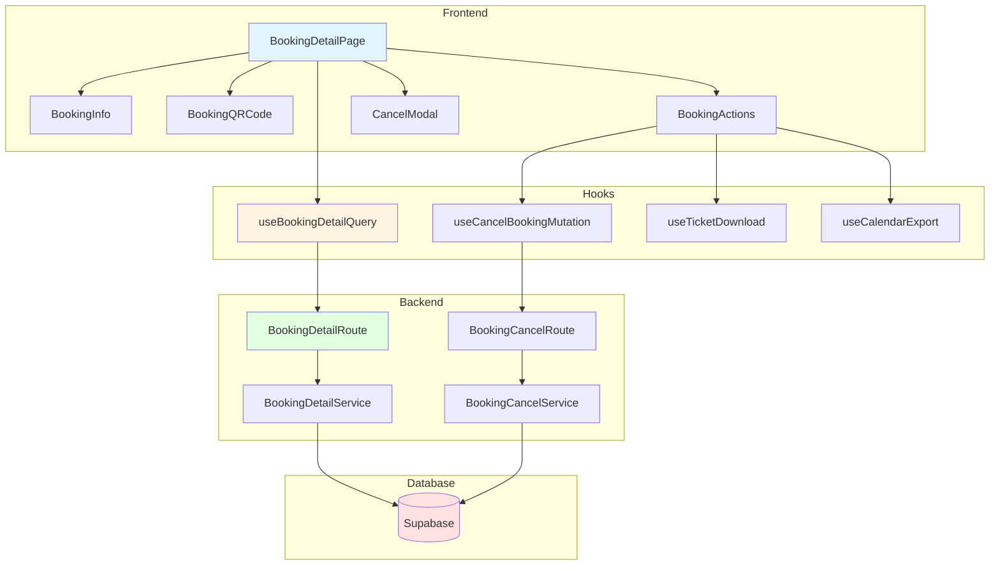

# 예약 상세 페이지 구현 계획

> **페이지 경로**: `/my/bookings/[id]`
> **관련 유스케이스**: UC-005 (예약 상세 조회), UC-006 (예약 취소)
> **문서 버전**: 1.0
> **작성일**: 2025-10-16

---

## 개요

예약 상세 페이지는 사용자가 자신의 예약 정보를 상세히 확인하고, QR코드를 통해 입장하거나, 필요시 예약을 취소할 수 있는 페이지입니다.

### 주요 기능
- 예약 상세 정보 조회
- QR코드 생성 및 확대
- 티켓 다운로드 (PNG)
- 캘린더 추가 (.ics)
- 지도 보기
- 예약 취소 (트랜잭션)

---

## 모듈 목록

### Backend Modules

| 모듈명 | 위치 | 설명 |
|--------|------|------|
| **BookingDetailService** | `src/features/bookings/backend/service.ts` | 예약 상세 조회 로직 |
| **BookingCancelService** | `src/features/bookings/backend/service.ts` | 예약 취소 로직 |
| **BookingDetailRoute** | `src/features/bookings/backend/route.ts` | GET `/api/my/bookings/[id]` |
| **BookingCancelRoute** | `src/features/bookings/backend/route.ts` | PATCH `/api/my/bookings/[id]/cancel` |
| **BookingDetailSchema** | `src/features/bookings/backend/schema.ts` | 상세 응답 스키마 |

### Frontend Modules

| 모듈명 | 위치 | 설명 |
|--------|------|------|
| **BookingDetailPage** | `src/app/(protected)/my/bookings/[id]/page.tsx` | 메인 페이지 |
| **BookingInfo** | `src/features/bookings/components/booking-info.tsx` | 예약 정보 섹션 |
| **BookingQRCode** | `src/features/bookings/components/booking-qrcode.tsx` | QR코드 표시 |
| **BookingActions** | `src/features/bookings/components/booking-actions.tsx` | 액션 버튼들 |
| **CancelModal** | `src/features/bookings/components/cancel-modal.tsx` | 취소 모달 |
| **useBookingDetailQuery** | `src/features/bookings/hooks/use-booking-detail-query.ts` | 상세 조회 훅 |
| **useCancelBookingMutation** | `src/features/bookings/hooks/use-cancel-booking-mutation.ts` | 취소 mutation |
| **useTicketDownload** | `src/features/bookings/hooks/use-ticket-download.ts` | 티켓 다운로드 |
| **useCalendarExport** | `src/features/bookings/hooks/use-calendar-export.ts` | 캘린더 내보내기 |

---

## 다이어그램

### 모듈 관계도



---

## Implementation Plan

### 1. Backend - BookingDetailSchema

```typescript
// src/features/bookings/backend/schema.ts

export const BookingDetailSchema = z.object({
  id: z.string().uuid(),
  bookingNumber: z.string(),
  status: z.enum(['confirmed', 'cancelled']),
  createdAt: z.string(),
  cancelledAt: z.string().nullable(),
  cancellationReason: z.string().nullable(),
  concert: z.object({
    title: z.string(),
    posterUrl: z.string().nullable(),
    performers: z.string().nullable(),
  }),
  schedule: z.object({
    concertDate: z.string(),
    concertTime: z.string(),
  }),
  venue: z.object({
    name: z.string(),
    address: z.string(),
    locationLat: z.number().nullable(),
    locationLng: z.number().nullable(),
  }),
  seats: z.array(z.object({
    seatNumber: z.string(),
    seatGrade: z.string(),
    price: z.number().int(),
  })),
  totalPrice: z.number().int(),
  isCancellable: z.boolean(),
});

export type BookingDetail = z.infer<typeof BookingDetailSchema>;

export const CancelBookingRequestSchema = z.object({
  reason: z.string().optional(),
  reasonDetail: z.string().max(500).optional(),
});
```

### 2. Backend - BookingDetailService & CancelService

```typescript
// src/features/bookings/backend/service.ts

export async function getBookingDetail(
  supabase: SupabaseClient,
  bookingId: string,
  userId: string
): Promise<HandlerResult<BookingDetail, BookingServiceError, unknown>> {
  try {
    const { data, error } = await supabase
      .from('bookings')
      .select(`
        id,
        booking_number,
        status,
        created_at,
        cancelled_at,
        cancellation_reason,
        concert_schedules!inner(
          concert_date,
          concert_time,
          concerts!inner(title, poster_url, performers, venues!inner(name, address, location_lat, location_lng))
        ),
        booking_seats!inner(seats!inner(seat_number, seat_grade, price))
      `)
      .eq('id', bookingId)
      .eq('user_id', userId)
      .single();

    if (error || !data) {
      return failure(404, 'BOOKING_NOT_FOUND', '예약을 찾을 수 없습니다.');
    }

    const concertDate = new Date(data.concert_schedules.concert_date);
    const now = new Date();
    const isCancellable =
      data.status === 'confirmed' &&
      concertDate > now &&
      (concertDate.getTime() - now.getTime()) > 24 * 60 * 60 * 1000; // 24시간 전까지

    const bookingDetail: BookingDetail = {
      id: data.id,
      bookingNumber: data.booking_number,
      status: data.status,
      createdAt: data.created_at,
      cancelledAt: data.cancelled_at,
      cancellationReason: data.cancellation_reason,
      concert: {
        title: data.concert_schedules.concerts.title,
        posterUrl: data.concert_schedules.concerts.poster_url,
        performers: data.concert_schedules.concerts.performers,
      },
      schedule: {
        concertDate: data.concert_schedules.concert_date,
        concertTime: data.concert_schedules.concert_time,
      },
      venue: {
        name: data.concert_schedules.concerts.venues.name,
        address: data.concert_schedules.concerts.venues.address,
        locationLat: data.concert_schedules.concerts.venues.location_lat,
        locationLng: data.concert_schedules.concerts.venues.location_lng,
      },
      seats: data.booking_seats.map((bs: any) => ({
        seatNumber: bs.seats.seat_number,
        seatGrade: bs.seats.seat_grade,
        price: bs.seats.price,
      })),
      totalPrice: data.booking_seats.reduce((sum: number, bs: any) => sum + bs.seats.price, 0),
      isCancellable,
    };

    return success(bookingDetail);
  } catch (error) {
    return failure(500, 'INTERNAL_ERROR', '예약 상세 조회 중 오류가 발생했습니다.', { error });
  }
}

export async function cancelBooking(
  supabase: SupabaseClient,
  bookingId: string,
  userId: string,
  reason?: string,
  reasonDetail?: string
): Promise<HandlerResult<{ success: boolean }, BookingServiceError, unknown>> {
  try {
    // Supabase RPC 호출 (트랜잭션)
    const { error } = await supabase.rpc('cancel_booking_transaction', {
      p_booking_id: bookingId,
      p_user_id: userId,
      p_reason: reason || null,
      p_reason_detail: reasonDetail || null,
    });

    if (error) {
      if (error.message.includes('ALREADY_CANCELLED')) {
        return failure(409, 'ALREADY_CANCELLED', '이미 취소된 예약입니다.');
      }
      if (error.message.includes('NOT_CANCELLABLE')) {
        return failure(400, 'NOT_CANCELLABLE', '취소 가능 기간이 지났습니다.');
      }
      throw error;
    }

    return success({ success: true });
  } catch (error) {
    return failure(500, 'INTERNAL_ERROR', '예약 취소 중 오류가 발생했습니다.', { error });
  }
}

// Supabase Function
/*
CREATE OR REPLACE FUNCTION cancel_booking_transaction(
  p_booking_id uuid,
  p_user_id uuid,
  p_reason text,
  p_reason_detail text
) RETURNS void AS $$
DECLARE
  v_schedule_id uuid;
  v_status text;
  v_concert_date date;
  v_seat_count int;
BEGIN
  -- 예약 정보 조회
  SELECT status, concert_schedule_id INTO v_status, v_schedule_id
  FROM bookings
  WHERE id = p_booking_id AND user_id = p_user_id
  FOR UPDATE;

  IF NOT FOUND THEN
    RAISE EXCEPTION 'BOOKING_NOT_FOUND';
  END IF;

  IF v_status = 'cancelled' THEN
    RAISE EXCEPTION 'ALREADY_CANCELLED';
  END IF;

  -- 취소 가능 기간 체크
  SELECT concert_date INTO v_concert_date
  FROM concert_schedules
  WHERE id = v_schedule_id;

  IF v_concert_date <= CURRENT_DATE OR
     v_concert_date - CURRENT_DATE < 1 THEN
    RAISE EXCEPTION 'NOT_CANCELLABLE';
  END IF;

  -- 예약 상태 업데이트
  UPDATE bookings
  SET status = 'cancelled',
      cancelled_at = NOW(),
      cancellation_reason = COALESCE(p_reason, '') || ' ' || COALESCE(p_reason_detail, ''),
      updated_at = NOW()
  WHERE id = p_booking_id;

  -- 좌석 상태 복원
  UPDATE seats
  SET status = 'available', updated_at = NOW()
  WHERE id IN (
    SELECT seat_id FROM booking_seats WHERE booking_id = p_booking_id
  );

  GET DIAGNOSTICS v_seat_count = ROW_COUNT;

  -- 예매 가능 좌석 수 복원
  UPDATE concert_schedules
  SET available_seats = available_seats + v_seat_count,
      is_sold_out = FALSE,
      updated_at = NOW()
  WHERE id = v_schedule_id;
END;
$$ LANGUAGE plpgsql;
*/
```

### 3. Frontend - useTicketDownload

```typescript
// src/features/bookings/hooks/use-ticket-download.ts

import { useCallback } from 'react';
import QRCode from 'qrcode';

export function useTicketDownload() {
  const downloadTicket = useCallback(async (booking: BookingDetail) => {
    try {
      const canvas = document.createElement('canvas');
      canvas.width = 800;
      canvas.height = 1200;
      const ctx = canvas.getContext('2d')!;

      // 배경
      ctx.fillStyle = '#ffffff';
      ctx.fillRect(0, 0, 800, 1200);

      // 제목
      ctx.fillStyle = '#000000';
      ctx.font = 'bold 32px sans-serif';
      ctx.fillText(booking.concert.title, 50, 100);

      // 날짜, 장소
      ctx.font = '24px sans-serif';
      ctx.fillText(`${booking.schedule.concertDate} ${booking.schedule.concertTime}`, 50, 150);
      ctx.fillText(booking.venue.name, 50, 190);

      // 좌석 정보
      ctx.font = '20px sans-serif';
      ctx.fillText(`좌석: ${booking.seats.map(s => s.seatNumber).join(', ')}`, 50, 240);

      // QR코드
      const qrDataUrl = await QRCode.toDataURL(booking.bookingNumber, { width: 300 });
      const qrImage = new Image();
      qrImage.src = qrDataUrl;
      await new Promise((resolve) => { qrImage.onload = resolve; });
      ctx.drawImage(qrImage, 250, 300);

      // 예약 번호
      ctx.font = '18px sans-serif';
      ctx.fillText(`예약번호: ${booking.bookingNumber}`, 250, 650);

      // 다운로드
      const link = document.createElement('a');
      link.download = `booking_${booking.bookingNumber}.png`;
      link.href = canvas.toDataURL('image/png');
      link.click();
    } catch (error) {
      console.error('티켓 다운로드 실패', error);
      throw error;
    }
  }, []);

  return { downloadTicket };
}
```

### 4. Frontend - useCalendarExport

```typescript
// src/features/bookings/hooks/use-calendar-export.ts

import { useCallback } from 'react';

export function useCalendarExport() {
  const exportToCalendar = useCallback((booking: BookingDetail) => {
    const startDate = new Date(`${booking.schedule.concertDate}T${booking.schedule.concertTime}`);
    const endDate = new Date(startDate.getTime() + 3 * 60 * 60 * 1000); // 3시간 후

    const formatDate = (date: Date) => {
      return date.toISOString().replace(/[-:]/g, '').split('.')[0] + 'Z';
    };

    const icsContent = `BEGIN:VCALENDAR
VERSION:2.0
PRODID:-//Concert Booking//EN
BEGIN:VEVENT
UID:${booking.id}@concertbooking.com
DTSTAMP:${formatDate(new Date())}
DTSTART:${formatDate(startDate)}
DTEND:${formatDate(endDate)}
SUMMARY:${booking.concert.title}
DESCRIPTION:예약번호: ${booking.bookingNumber}\\n좌석: ${booking.seats.map(s => s.seatNumber).join(', ')}
LOCATION:${booking.venue.address}
BEGIN:VALARM
TRIGGER:-PT3H
DESCRIPTION:공연 3시간 전 알림
ACTION:DISPLAY
END:VALARM
END:VEVENT
END:VCALENDAR`;

    const blob = new Blob([icsContent], { type: 'text/calendar;charset=utf-8' });
    const link = document.createElement('a');
    link.href = URL.createObjectURL(blob);
    link.download = `concert_${booking.bookingNumber}.ics`;
    link.click();
  }, []);

  return { exportToCalendar };
}
```

### 5. Frontend - BookingDetailPage

```typescript
// src/app/(protected)/my/bookings/[id]/page.tsx
'use client';

import { use, useState } from 'react';
import { useBookingDetailQuery } from '@/features/bookings/hooks/use-booking-detail-query';
import { useTicketDownload } from '@/features/bookings/hooks/use-ticket-download';
import { useCalendarExport } from '@/features/bookings/hooks/use-calendar-export';
import BookingInfo from '@/features/bookings/components/booking-info';
import BookingQRCode from '@/features/bookings/components/booking-qrcode';
import BookingActions from '@/features/bookings/components/booking-actions';
import CancelModal from '@/features/bookings/components/cancel-modal';

export default function BookingDetailPage({
  params,
}: {
  params: Promise<{ id: string }>;
}) {
  const { id } = use(params);
  const { data: booking, isLoading, error } = useBookingDetailQuery(id);
  const { downloadTicket } = useTicketDownload();
  const { exportToCalendar } = useCalendarExport();
  const [isCancelModalOpen, setIsCancelModalOpen] = useState(false);

  if (isLoading) return <div>로딩 중...</div>;
  if (error || !booking) return <div>예약을 찾을 수 없습니다.</div>;

  return (
    <div className="container py-8">
      <div className="max-w-4xl mx-auto">
        <h1 className="text-3xl font-bold mb-8">예약 상세</h1>

        <BookingInfo booking={booking} />
        <BookingQRCode bookingNumber={booking.bookingNumber} />

        <BookingActions
          booking={booking}
          onDownload={() => downloadTicket(booking)}
          onCalendar={() => exportToCalendar(booking)}
          onCancel={() => setIsCancelModalOpen(true)}
        />

        <CancelModal
          isOpen={isCancelModalOpen}
          onClose={() => setIsCancelModalOpen(false)}
          bookingId={booking.id}
        />
      </div>
    </div>
  );
}
```

---

## QA Sheet

| 시나리오 | 입력 | 기대 결과 |
|---------|------|----------|
| 상세 정보 로드 | 예약 ID | 콘서트 정보, QR코드, 좌석 정보 표시 |
| QR코드 확대 | 확대 버튼 클릭 | 전체화면 모달, 화면 밝기 증가 |
| 티켓 다운로드 | 다운로드 버튼 | PNG 파일 다운로드 |
| 캘린더 추가 | 캘린더 버튼 | .ics 파일 다운로드 |
| 예약 취소 | 취소 버튼 | 모달 표시, 사유 선택, 최종 확인 |
| 취소 완료 | 최종 취소 | 트랜잭션 성공, 취소 상태로 갱신 |
| 권한 없음 | 다른 사용자 예약 접근 | 403 에러 |

---

## 구현 순서

1. **Backend** (2일)
   - [ ] BookingDetailService, CancelService
   - [ ] Supabase Functions (RPC)
   - [ ] Route 등록

2. **Frontend Hooks** (1일)
   - [ ] useBookingDetailQuery
   - [ ] useCancelBookingMutation
   - [ ] useTicketDownload, useCalendarExport

3. **UI 컴포넌트** (2일)
   - [ ] BookingInfo, BookingQRCode
   - [ ] BookingActions, CancelModal

4. **통합 및 테스트** (1일)

**총 예상 기간**: 5~6일

---

**문서 종료**
