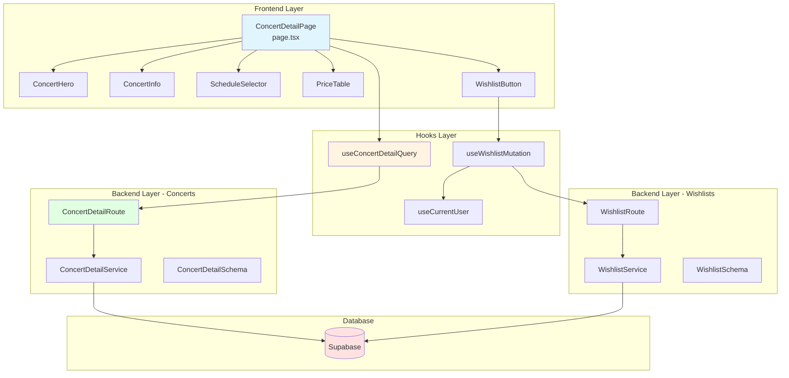

# 콘서트 상세 페이지 구현 계획

> **페이지 경로**: `/concerts/[id]`
> **관련 유스케이스**: UC-002 (콘서트 상세 조회)
> **문서 버전**: 1.0
> **작성일**: 2025-10-16

---

## 개요

콘서트 상세 페이지는 사용자가 선택한 콘서트의 상세 정보를 확인하고, 공연 날짜/시간을 선택하여 좌석 선택 페이지로 이동하거나 위시리스트에 추가할 수 있는 페이지입니다.

### 주요 기능
- 콘서트 상세 정보 조회
- 공연 날짜/시간(회차) 선택
- 위시리스트 추가/제거 (낙관적 업데이트)
- 좌석 선택 페이지로 이동

---

## 모듈 목록

### Backend Modules

| 모듈명 | 위치 | 설명 |
|--------|------|------|
| **ConcertDetailService** | `src/features/concerts/backend/service.ts` (추가) | 콘서트 상세 조회 로직 |
| **ConcertDetailRoute** | `src/features/concerts/backend/route.ts` (추가) | GET `/api/concerts/[id]` |
| **ConcertDetailSchema** | `src/features/concerts/backend/schema.ts` (추가) | 상세 응답 스키마 |
| **WishlistService** | `src/features/wishlists/backend/service.ts` | 위시리스트 추가/제거 로직 |
| **WishlistRoute** | `src/features/wishlists/backend/route.ts` | POST/DELETE `/api/wishlists` |
| **WishlistSchema** | `src/features/wishlists/backend/schema.ts` | 위시리스트 스키마 |

### Frontend Modules

| 모듈명 | 위치 | 설명 |
|--------|------|------|
| **ConcertDetailPage** | `src/app/concerts/[id]/page.tsx` | 메인 페이지 컴포넌트 |
| **ConcertHero** | `src/features/concerts/components/concert-hero.tsx` | 히어로 섹션 (포스터, 제목) |
| **ConcertInfo** | `src/features/concerts/components/concert-info.tsx` | 콘서트 정보 섹션 |
| **ScheduleSelector** | `src/features/concerts/components/schedule-selector.tsx` | 회차 선택 UI |
| **PriceTable** | `src/features/concerts/components/price-table.tsx` | 좌석 등급별 가격표 |
| **WishlistButton** | `src/features/wishlists/components/wishlist-button.tsx` | 위시리스트 버튼 |
| **useConcertDetailQuery** | `src/features/concerts/hooks/use-concert-detail-query.ts` | 상세 조회 훅 |
| **useWishlistMutation** | `src/features/wishlists/hooks/use-wishlist-mutation.ts` | 위시리스트 mutation |

---

## 다이어그램

### 모듈 관계도



---

## Implementation Plan

### 1. Backend - ConcertDetailService

```typescript
// src/features/concerts/backend/service.ts (추가)

export const ConcertDetailSchema = z.object({
  id: z.string().uuid(),
  title: z.string(),
  posterUrl: z.string().nullable(),
  description: z.string().nullable(),
  genre: z.string().nullable(),
  performers: z.string().nullable(),
  rating: z.string().nullable(),
  runningTime: z.number().int().nullable(),
  status: z.string(),
  venue: z.object({
    id: z.string().uuid(),
    name: z.string(),
    address: z.string(),
    locationLat: z.number().nullable(),
    locationLng: z.number().nullable(),
  }),
  schedules: z.array(z.object({
    id: z.string().uuid(),
    concertDate: z.string(),
    concertTime: z.string(),
    availableSeats: z.number().int(),
    isSoldOut: z.boolean(),
    isBookingOpen: z.boolean(),
  })),
  priceTable: z.array(z.object({
    seatGrade: z.string(),
    minPrice: z.number().int(),
    maxPrice: z.number().int(),
  })),
  isWishlisted: z.boolean(),
});

export type ConcertDetail = z.infer<typeof ConcertDetailSchema>;

export async function getConcertDetail(
  supabase: SupabaseClient,
  concertId: string,
  userId?: string
): Promise<HandlerResult<ConcertDetail, ConcertServiceError, unknown>> {
  try {
    // 1. 콘서트 기본 정보
    const { data: concert, error: concertError } = await supabase
      .from('concerts')
      .select(`
        id,
        title,
        poster_url,
        description,
        genre,
        performers,
        rating,
        running_time,
        status,
        venues!inner(id, name, address, location_lat, location_lng)
      `)
      .eq('id', concertId)
      .eq('is_deleted', false)
      .single();

    if (concertError || !concert) {
      return failure(404, concertErrorCodes.CONCERT_NOT_FOUND, '콘서트를 찾을 수 없습니다.');
    }

    // 2. 회차 목록
    const { data: schedules } = await supabase
      .from('concert_schedules')
      .select('id, concert_date, concert_time, available_seats, is_sold_out, is_booking_open')
      .eq('concert_id', concertId)
      .order('concert_date', { ascending: true })
      .order('concert_time', { ascending: true });

    // 3. 가격 정보
    const { data: prices } = await supabase
      .from('seats')
      .select('seat_grade, price')
      .in('concert_schedule_id', schedules?.map(s => s.id) || []);

    const priceTable = Object.values(
      prices?.reduce((acc, { seat_grade, price }) => {
        if (!acc[seat_grade]) {
          acc[seat_grade] = { seatGrade: seat_grade, minPrice: price, maxPrice: price };
        } else {
          acc[seat_grade].minPrice = Math.min(acc[seat_grade].minPrice, price);
          acc[seat_grade].maxPrice = Math.max(acc[seat_grade].maxPrice, price);
        }
        return acc;
      }, {} as Record<string, any>) || {}
    );

    // 4. 위시리스트 여부
    let isWishlisted = false;
    if (userId) {
      const { data: wishlist } = await supabase
        .from('wishlists')
        .select('id')
        .eq('user_id', userId)
        .eq('concert_id', concertId)
        .maybeSingle();
      isWishlisted = !!wishlist;
    }

    const result: ConcertDetail = {
      id: concert.id,
      title: concert.title,
      posterUrl: concert.poster_url,
      description: concert.description,
      genre: concert.genre,
      performers: concert.performers,
      rating: concert.rating,
      runningTime: concert.running_time,
      status: concert.status,
      venue: {
        id: concert.venues.id,
        name: concert.venues.name,
        address: concert.venues.address,
        locationLat: concert.venues.location_lat,
        locationLng: concert.venues.location_lng,
      },
      schedules: schedules?.map(s => ({
        id: s.id,
        concertDate: s.concert_date,
        concertTime: s.concert_time,
        availableSeats: s.available_seats,
        isSoldOut: s.is_sold_out,
        isBookingOpen: s.is_booking_open,
      })) || [],
      priceTable,
      isWishlisted,
    };

    return success(result);
  } catch (error) {
    return failure(500, 'INTERNAL_ERROR', '콘서트 상세 조회 중 오류가 발생했습니다.', { error });
  }
}
```

### 2. Backend - WishlistService

```typescript
// src/features/wishlists/backend/service.ts

export async function addToWishlist(
  supabase: SupabaseClient,
  userId: string,
  concertId: string
): Promise<HandlerResult<{ success: boolean }, WishlistServiceError, unknown>> {
  try {
    const { error } = await supabase
      .from('wishlists')
      .insert({ user_id: userId, concert_id: concertId });

    if (error) {
      if (error.code === '23505') { // UNIQUE 제약 위반
        return failure(409, 'ALREADY_WISHLISTED', '이미 위시리스트에 추가되어 있습니다.');
      }
      throw error;
    }

    return success({ success: true });
  } catch (error) {
    return failure(500, 'INTERNAL_ERROR', '위시리스트 추가 중 오류가 발생했습니다.', { error });
  }
}

export async function removeFromWishlist(
  supabase: SupabaseClient,
  userId: string,
  concertId: string
): Promise<HandlerResult<{ success: boolean }, WishlistServiceError, unknown>> {
  try {
    const { error } = await supabase
      .from('wishlists')
      .delete()
      .eq('user_id', userId)
      .eq('concert_id', concertId);

    if (error) throw error;

    return success({ success: true });
  } catch (error) {
    return failure(500, 'INTERNAL_ERROR', '위시리스트 제거 중 오류가 발생했습니다.', { error });
  }
}
```

### 3. Frontend - useConcertDetailQuery

```typescript
// src/features/concerts/hooks/use-concert-detail-query.ts

import { useQuery } from '@tanstack/react-query';
import { apiClient } from '@/lib/remote/api-client';
import { ConcertDetailSchema, ConcertDetail } from '../lib/dto';

export function useConcertDetailQuery(concertId: string) {
  return useQuery<ConcertDetail>({
    queryKey: ['concerts', 'detail', concertId],
    queryFn: async () => {
      const { data } = await apiClient.get(`/api/concerts/${concertId}`);
      return ConcertDetailSchema.parse(data);
    },
    staleTime: 5 * 60 * 1000, // 5분
  });
}
```

### 4. Frontend - useWishlistMutation

```typescript
// src/features/wishlists/hooks/use-wishlist-mutation.ts

import { useMutation, useQueryClient } from '@tanstack/react-query';
import { apiClient } from '@/lib/remote/api-client';
import { useCurrentUser } from '@/features/auth/hooks/useCurrentUser';
import { useRouter } from 'next/navigation';

export function useWishlistMutation(concertId: string) {
  const queryClient = useQueryClient();
  const { user } = useCurrentUser();
  const router = useRouter();

  const addMutation = useMutation({
    mutationFn: async () => {
      if (!user) {
        router.push(`/login?redirectedFrom=/concerts/${concertId}`);
        throw new Error('로그인이 필요합니다.');
      }
      await apiClient.post('/api/wishlists', { concertId });
    },
    onMutate: async () => {
      // 낙관적 업데이트
      await queryClient.cancelQueries({ queryKey: ['concerts', 'detail', concertId] });
      const previousData = queryClient.getQueryData(['concerts', 'detail', concertId]);

      queryClient.setQueryData(['concerts', 'detail', concertId], (old: any) => ({
        ...old,
        isWishlisted: true,
      }));

      return { previousData };
    },
    onError: (err, variables, context) => {
      // 롤백
      if (context?.previousData) {
        queryClient.setQueryData(['concerts', 'detail', concertId], context.previousData);
      }
    },
    onSettled: () => {
      queryClient.invalidateQueries({ queryKey: ['concerts', 'detail', concertId] });
    },
  });

  const removeMutation = useMutation({
    mutationFn: async () => {
      await apiClient.delete('/api/wishlists', { data: { concertId } });
    },
    onMutate: async () => {
      await queryClient.cancelQueries({ queryKey: ['concerts', 'detail', concertId] });
      const previousData = queryClient.getQueryData(['concerts', 'detail', concertId]);

      queryClient.setQueryData(['concerts', 'detail', concertId], (old: any) => ({
        ...old,
        isWishlisted: false,
      }));

      return { previousData };
    },
    onError: (err, variables, context) => {
      if (context?.previousData) {
        queryClient.setQueryData(['concerts', 'detail', concertId], context.previousData);
      }
    },
    onSettled: () => {
      queryClient.invalidateQueries({ queryKey: ['concerts', 'detail', concertId] });
    },
  });

  return { addMutation, removeMutation };
}
```

### 5. Frontend - ConcertDetailPage

```typescript
// src/app/concerts/[id]/page.tsx
'use client';

import { use } from 'react';
import { useConcertDetailQuery } from '@/features/concerts/hooks/use-concert-detail-query';
import { useState } from 'react';
import { useRouter } from 'next/navigation';
import ConcertHero from '@/features/concerts/components/concert-hero';
import ConcertInfo from '@/features/concerts/components/concert-info';
import ScheduleSelector from '@/features/concerts/components/schedule-selector';
import PriceTable from '@/features/concerts/components/price-table';

export default function ConcertDetailPage({
  params,
}: {
  params: Promise<{ id: string }>;
}) {
  const { id } = use(params);
  const router = useRouter();
  const { data: concert, isLoading, error } = useConcertDetailQuery(id);
  const [selectedScheduleId, setSelectedScheduleId] = useState<string | null>(null);

  const handleSeatSelection = () => {
    if (!selectedScheduleId) {
      alert('공연 날짜/시간을 선택해주세요.');
      return;
    }
    router.push(`/concerts/${id}/seats?scheduleId=${selectedScheduleId}`);
  };

  if (isLoading) return <div>로딩 중...</div>;
  if (error || !concert) return <div>콘서트를 찾을 수 없습니다.</div>;

  return (
    <div>
      <ConcertHero concert={concert} />
      <div className="container py-8">
        <ConcertInfo concert={concert} />
        <ScheduleSelector
          schedules={concert.schedules}
          selectedId={selectedScheduleId}
          onChange={setSelectedScheduleId}
        />
        <PriceTable priceTable={concert.priceTable} />
        <button
          onClick={handleSeatSelection}
          disabled={!selectedScheduleId}
          className="mt-8 w-full py-4 bg-primary text-white rounded disabled:opacity-50"
        >
          좌석 선택
        </button>
      </div>
    </div>
  );
}
```

---

## QA Sheet

| 시나리오 | 입력 | 기대 결과 |
|---------|------|----------|
| 상세 정보 로드 | 콘서트 ID | 포스터, 제목, 설명, 회차 목록 표시 |
| 회차 선택 | 특정 날짜 클릭 | 해당 회차 하이라이트 |
| 매진 회차 | 매진 회차 클릭 | 선택 불가, 매진 배지 표시 |
| 위시리스트 추가 (로그인) | 하트 버튼 클릭 | 즉시 하트 채움, API 성공 |
| 위시리스트 추가 (비로그인) | 하트 버튼 클릭 | 로그인 페이지로 리다이렉트 |
| 위시리스트 제거 | 채워진 하트 클릭 | 즉시 하트 비움, API 성공 |
| 좌석 선택 (회차 미선택) | 좌석 선택 버튼 | 안내 메시지 표시 |
| 좌석 선택 (회차 선택) | 좌석 선택 버튼 | `/concerts/[id]/seats?scheduleId=...` 이동 |
| 존재하지 않는 ID | 잘못된 ID | 404 페이지 |

---

## 구현 순서

1. **Backend** (1~2일)
   - [ ] ConcertDetailSchema, WishlistSchema 작성
   - [ ] ConcertDetailService, WishlistService 구현
   - [ ] Route 등록

2. **Frontend Hooks** (1일)
   - [ ] useConcertDetailQuery 구현
   - [ ] useWishlistMutation 구현

3. **UI 컴포넌트** (2일)
   - [ ] ConcertHero, ConcertInfo, ScheduleSelector, PriceTable, WishlistButton

4. **페이지 통합 및 테스트** (1일)

**총 예상 기간**: 4~5일

---

**문서 종료**
