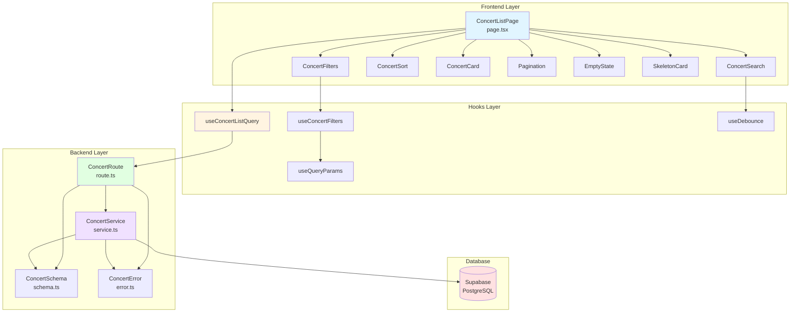
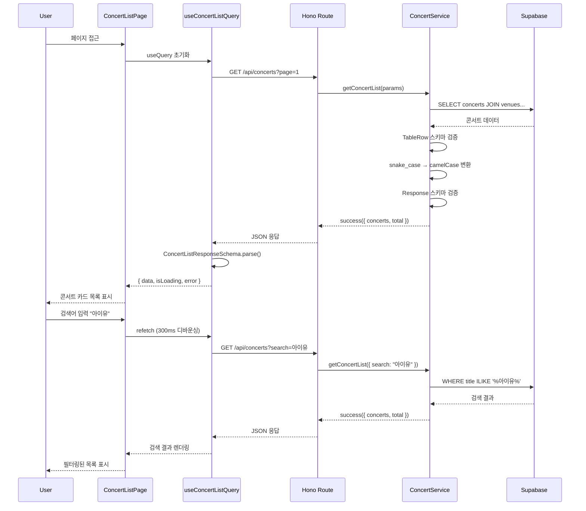

# 콘서트 목록 페이지 구현 계획

> **페이지 경로**: `/concerts`
> **관련 유스케이스**: UC-001 (콘서트 목록 조회 및 검색)
> **문서 버전**: 1.0
> **작성일**: 2025-10-16

---

## 개요

콘서트 목록 페이지는 사용자가 예매 가능한 콘서트를 탐색하고 검색하며, 필터링 및 정렬을 통해 원하는 콘서트를 찾을 수 있는 핵심 페이지입니다.

### 주요 기능
- 콘서트 목록 조회 (페이지네이션)
- 실시간 검색 (제목, 출연진)
- 다중 필터링 (장르, 날짜 범위, 지역, 가격대)
- 정렬 (최신순, 인기순, 가격순)
- URL 파라미터 동기화 (공유 가능)

---

## 모듈 목록

### Backend Modules

| 모듈명 | 위치 | 설명 |
|--------|------|------|
| **ConcertService** | `src/features/concerts/backend/service.ts` | 콘서트 목록 조회 비즈니스 로직 |
| **ConcertRoute** | `src/features/concerts/backend/route.ts` | Hono 라우터 (GET `/api/concerts`) |
| **ConcertSchema** | `src/features/concerts/backend/schema.ts` | 요청/응답 Zod 스키마 |
| **ConcertError** | `src/features/concerts/backend/error.ts` | 에러 코드 정의 |

### Frontend Modules

| 모듈명 | 위치 | 설명 |
|--------|------|------|
| **ConcertListPage** | `src/app/concerts/page.tsx` | 메인 페이지 컴포넌트 |
| **ConcertCard** | `src/features/concerts/components/concert-card.tsx` | 콘서트 카드 UI |
| **ConcertFilters** | `src/features/concerts/components/concert-filters.tsx` | 필터 UI (사이드바 또는 상단) |
| **ConcertSearch** | `src/features/concerts/components/concert-search.tsx` | 검색창 컴포넌트 |
| **ConcertSort** | `src/features/concerts/components/concert-sort.tsx` | 정렬 드롭다운 |
| **useConcertListQuery** | `src/features/concerts/hooks/use-concert-list-query.ts` | React Query 훅 |
| **useConcertFilters** | `src/features/concerts/hooks/use-concert-filters.ts` | URL 동기화 필터 훅 |
| **ConcertDTO** | `src/features/concerts/lib/dto.ts` | backend/schema 재노출 |

### Shared Modules (공통)

| 모듈명 | 위치 | 설명 |
|--------|------|------|
| **Pagination** | `src/components/shared/pagination.tsx` | 페이지네이션 공통 컴포넌트 |
| **EmptyState** | `src/components/shared/empty-state.tsx` | 빈 상태 UI |
| **SkeletonCard** | `src/components/shared/skeleton-card.tsx` | 로딩 스켈레톤 |
| **useDebounce** | `src/hooks/use-debounce.ts` | 디바운스 훅 |
| **useQueryParams** | `src/hooks/use-query-params.ts` | URL 파라미터 관리 훅 |

---

## 다이어그램

### 모듈 관계도



### 데이터 흐름



---

## Implementation Plan

### 1. Backend Implementation

#### 1.1 ConcertSchema (`src/features/concerts/backend/schema.ts`)

**목적**: API 요청/응답 스키마 정의

```typescript
import { z } from 'zod';

// 요청 쿼리 파라미터 스키마
export const ConcertListQuerySchema = z.object({
  page: z.coerce.number().int().positive().default(1),
  limit: z.coerce.number().int().min(1).max(100).default(20),
  search: z.string().optional(),
  genre: z.string().optional(),
  dateFrom: z.string().datetime().optional(),
  dateTo: z.string().datetime().optional(),
  region: z.string().optional(),
  priceMin: z.coerce.number().int().min(0).optional(),
  priceMax: z.coerce.number().int().min(0).optional(),
  sortBy: z.enum(['latest', 'popularity', 'price']).default('latest'),
});

export type ConcertListQuery = z.infer<typeof ConcertListQuerySchema>;

// DB 테이블 row 스키마 (snake_case)
export const ConcertTableRowSchema = z.object({
  id: z.string().uuid(),
  title: z.string(),
  poster_url: z.string().nullable(),
  genre: z.string().nullable(),
  performers: z.string().nullable(),
  venue_name: z.string(),
  venue_address: z.string(),
  nearest_date: z.string(), // DATE from DB
  min_price: z.number().int(),
  available_seats: z.number().int(),
});

export type ConcertTableRow = z.infer<typeof ConcertTableRowSchema>;

// API 응답 스키마 (camelCase)
export const ConcertItemSchema = z.object({
  id: z.string().uuid(),
  title: z.string(),
  posterUrl: z.string().nullable(),
  genre: z.string().nullable(),
  performers: z.string().nullable(),
  venueName: z.string(),
  venueAddress: z.string(),
  nearestDate: z.string(), // ISO date string
  minPrice: z.number().int(),
  availableSeats: z.number().int(),
});

export type ConcertItem = z.infer<typeof ConcertItemSchema>;

export const ConcertListResponseSchema = z.object({
  concerts: z.array(ConcertItemSchema),
  total: z.number().int(),
  page: z.number().int(),
  limit: z.number().int(),
  hasMore: z.boolean(),
});

export type ConcertListResponse = z.infer<typeof ConcertListResponseSchema>;
```

**Unit Test 포함**:
```typescript
// __tests__/schema.test.ts
describe('ConcertListQuerySchema', () => {
  it('should parse valid query params', () => {
    const result = ConcertListQuerySchema.parse({
      page: '1',
      limit: '20',
      search: '아이유',
      sortBy: 'popularity',
    });
    expect(result.page).toBe(1);
    expect(result.limit).toBe(20);
  });

  it('should apply default values', () => {
    const result = ConcertListQuerySchema.parse({});
    expect(result.page).toBe(1);
    expect(result.limit).toBe(20);
    expect(result.sortBy).toBe('latest');
  });

  it('should reject invalid sortBy', () => {
    expect(() =>
      ConcertListQuerySchema.parse({ sortBy: 'invalid' })
    ).toThrow();
  });
});
```

---

#### 1.2 ConcertError (`src/features/concerts/backend/error.ts`)

**목적**: 에러 코드 정의

```typescript
export const concertErrorCodes = {
  CONCERT_NOT_FOUND: 'CONCERT_NOT_FOUND',
  INVALID_FILTER: 'INVALID_FILTER',
  INVALID_SORT: 'INVALID_SORT',
} as const;

export type ConcertServiceError = keyof typeof concertErrorCodes;
```

---

#### 1.3 ConcertService (`src/features/concerts/backend/service.ts`)

**목적**: 콘서트 목록 조회 비즈니스 로직

```typescript
import { SupabaseClient } from '@supabase/supabase-js';
import { HandlerResult, success, failure } from '@/backend/http/response';
import {
  ConcertListQuery,
  ConcertListResponse,
  ConcertTableRow,
  ConcertTableRowSchema,
  ConcertItem,
} from './schema';
import { ConcertServiceError, concertErrorCodes } from './error';

export async function getConcertList(
  supabase: SupabaseClient,
  query: ConcertListQuery
): Promise<HandlerResult<ConcertListResponse, ConcertServiceError, unknown>> {
  try {
    const { page, limit, search, genre, dateFrom, dateTo, region, priceMin, priceMax, sortBy } = query;
    const offset = (page - 1) * limit;

    // Base query
    let dbQuery = supabase
      .from('concerts')
      .select(`
        id,
        title,
        poster_url,
        genre,
        performers,
        venues!inner(name, address),
        concert_schedules!inner(concert_date),
        seats!inner(price)
      `, { count: 'exact' })
      .eq('is_deleted', false)
      .eq('status', 'active');

    // Search filter
    if (search) {
      dbQuery = dbQuery.or(`title.ilike.%${search}%,performers.ilike.%${search}%`);
    }

    // Genre filter
    if (genre) {
      dbQuery = dbQuery.eq('genre', genre);
    }

    // Date range filter
    if (dateFrom || dateTo) {
      if (dateFrom) dbQuery = dbQuery.gte('concert_schedules.concert_date', dateFrom);
      if (dateTo) dbQuery = dbQuery.lte('concert_schedules.concert_date', dateTo);
    }

    // Region filter
    if (region) {
      dbQuery = dbQuery.ilike('venues.address', `%${region}%`);
    }

    // Price range filter
    if (priceMin !== undefined || priceMax !== undefined) {
      if (priceMin !== undefined) dbQuery = dbQuery.gte('seats.price', priceMin);
      if (priceMax !== undefined) dbQuery = dbQuery.lte('seats.price', priceMax);
    }

    // Sorting
    switch (sortBy) {
      case 'latest':
        dbQuery = dbQuery.order('created_at', { ascending: false });
        break;
      case 'popularity':
        dbQuery = dbQuery.order('popularity', { ascending: false });
        break;
      case 'price':
        dbQuery = dbQuery.order('seats.price', { ascending: true });
        break;
    }

    // Pagination
    dbQuery = dbQuery.range(offset, offset + limit - 1);

    const { data, error, count } = await dbQuery;

    if (error) {
      return failure(500, 'DATABASE_ERROR', error.message, { originalError: error });
    }

    if (!data) {
      return success({
        concerts: [],
        total: 0,
        page,
        limit,
        hasMore: false,
      });
    }

    // Aggregate and validate data
    const concerts: ConcertItem[] = data.map((row: any) => {
      // Validate with TableRow schema
      const validated = ConcertTableRowSchema.parse({
        id: row.id,
        title: row.title,
        poster_url: row.poster_url,
        genre: row.genre,
        performers: row.performers,
        venue_name: row.venues.name,
        venue_address: row.venues.address,
        nearest_date: row.concert_schedules[0]?.concert_date,
        min_price: Math.min(...row.seats.map((s: any) => s.price)),
        available_seats: row.seats.length,
      });

      // Transform to camelCase
      return {
        id: validated.id,
        title: validated.title,
        posterUrl: validated.poster_url,
        genre: validated.genre,
        performers: validated.performers,
        venueName: validated.venue_name,
        venueAddress: validated.venue_address,
        nearestDate: validated.nearest_date,
        minPrice: validated.min_price,
        availableSeats: validated.available_seats,
      };
    });

    const total = count ?? 0;
    const hasMore = offset + limit < total;

    return success({
      concerts,
      total,
      page,
      limit,
      hasMore,
    });
  } catch (error) {
    return failure(500, 'INTERNAL_ERROR', '콘서트 목록 조회 중 오류가 발생했습니다.', { error });
  }
}
```

**Unit Test**:
```typescript
// __tests__/service.test.ts
describe('getConcertList', () => {
  it('should return concerts with default pagination', async () => {
    const result = await getConcertList(mockSupabase, {
      page: 1,
      limit: 20,
      sortBy: 'latest',
    });

    expect(result.ok).toBe(true);
    if (result.ok) {
      expect(result.data.concerts).toBeInstanceOf(Array);
      expect(result.data.page).toBe(1);
      expect(result.data.limit).toBe(20);
    }
  });

  it('should filter by search query', async () => {
    const result = await getConcertList(mockSupabase, {
      page: 1,
      limit: 20,
      search: '아이유',
      sortBy: 'latest',
    });

    expect(result.ok).toBe(true);
    if (result.ok) {
      result.data.concerts.forEach(concert => {
        expect(
          concert.title.includes('아이유') || concert.performers?.includes('아이유')
        ).toBe(true);
      });
    }
  });
});
```

---

#### 1.4 ConcertRoute (`src/features/concerts/backend/route.ts`)

**목적**: Hono 라우터 정의

```typescript
import { Hono } from 'hono';
import { AppEnv, getSupabase, getLogger } from '@/backend/hono/context';
import { respond } from '@/backend/http/response';
import { ConcertListQuerySchema } from './schema';
import { getConcertList } from './service';

export function registerConcertRoutes(app: Hono<AppEnv>) {
  // GET /api/concerts
  app.get('/api/concerts', async (c) => {
    const logger = getLogger(c);
    const supabase = getSupabase(c);

    // Query 파라미터 파싱 및 검증
    const queryParseResult = ConcertListQuerySchema.safeParse(c.req.query());

    if (!queryParseResult.success) {
      logger.warn('Invalid query parameters', queryParseResult.error);
      return c.json(
        { error: { message: '잘못된 요청 파라미터입니다.', details: queryParseResult.error } },
        400
      );
    }

    const query = queryParseResult.data;
    logger.info('Fetching concert list', { query });

    const result = await getConcertList(supabase, query);
    return respond(c, result);
  });
}
```

---

### 2. Frontend Implementation

#### 2.1 DTO 재노출 (`src/features/concerts/lib/dto.ts`)

```typescript
export {
  ConcertListResponseSchema,
  type ConcertListResponse,
  type ConcertItem,
} from '@/features/concerts/backend/schema';
```

---

#### 2.2 useConcertListQuery (`src/features/concerts/hooks/use-concert-list-query.ts`)

**목적**: React Query를 사용한 데이터 페칭

```typescript
import { useQuery, UseQueryOptions } from '@tanstack/react-query';
import { apiClient, extractApiErrorMessage } from '@/lib/remote/api-client';
import { ConcertListResponseSchema, ConcertListResponse } from '../lib/dto';

export interface UseConcertListQueryParams {
  page?: number;
  limit?: number;
  search?: string;
  genre?: string;
  dateFrom?: string;
  dateTo?: string;
  region?: string;
  priceMin?: number;
  priceMax?: number;
  sortBy?: 'latest' | 'popularity' | 'price';
}

export function useConcertListQuery(
  params: UseConcertListQueryParams,
  options?: Omit<UseQueryOptions<ConcertListResponse>, 'queryKey' | 'queryFn'>
) {
  return useQuery<ConcertListResponse>({
    queryKey: ['concerts', 'list', params],
    queryFn: async () => {
      const { data } = await apiClient.get('/api/concerts', { params });
      return ConcertListResponseSchema.parse(data);
    },
    ...options,
  });
}
```

---

#### 2.3 useConcertFilters (`src/features/concerts/hooks/use-concert-filters.ts`)

**목적**: URL 파라미터와 동기화된 필터 상태 관리

```typescript
import { useRouter, useSearchParams } from 'next/navigation';
import { useCallback, useMemo } from 'react';

export interface ConcertFilters {
  search: string;
  genre: string | null;
  dateFrom: string | null;
  dateTo: string | null;
  region: string | null;
  priceMin: number | null;
  priceMax: number | null;
  sortBy: 'latest' | 'popularity' | 'price';
  page: number;
}

export function useConcertFilters() {
  const router = useRouter();
  const searchParams = useSearchParams();

  const filters = useMemo<ConcertFilters>(() => ({
    search: searchParams.get('search') || '',
    genre: searchParams.get('genre'),
    dateFrom: searchParams.get('dateFrom'),
    dateTo: searchParams.get('dateTo'),
    region: searchParams.get('region'),
    priceMin: searchParams.get('priceMin') ? Number(searchParams.get('priceMin')) : null,
    priceMax: searchParams.get('priceMax') ? Number(searchParams.get('priceMax')) : null,
    sortBy: (searchParams.get('sortBy') as any) || 'latest',
    page: searchParams.get('page') ? Number(searchParams.get('page')) : 1,
  }), [searchParams]);

  const setFilters = useCallback((newFilters: Partial<ConcertFilters>) => {
    const params = new URLSearchParams(searchParams.toString());

    Object.entries(newFilters).forEach(([key, value]) => {
      if (value === null || value === '' || value === undefined) {
        params.delete(key);
      } else {
        params.set(key, String(value));
      }
    });

    // 필터 변경 시 페이지는 1로 리셋 (단, page 자체를 변경하는 경우 제외)
    if (!('page' in newFilters)) {
      params.set('page', '1');
    }

    router.push(`/concerts?${params.toString()}`);
  }, [router, searchParams]);

  const resetFilters = useCallback(() => {
    router.push('/concerts');
  }, [router]);

  const hasActiveFilters = useMemo(() => {
    return filters.search !== '' ||
      filters.genre !== null ||
      filters.dateFrom !== null ||
      filters.dateTo !== null ||
      filters.region !== null ||
      filters.priceMin !== null ||
      filters.priceMax !== null;
  }, [filters]);

  return {
    filters,
    setFilters,
    resetFilters,
    hasActiveFilters,
  };
}
```

---

#### 2.4 ConcertListPage (`src/app/concerts/page.tsx`)

**목적**: 메인 페이지 컴포넌트

```typescript
'use client';

import { useConcertListQuery } from '@/features/concerts/hooks/use-concert-list-query';
import { useConcertFilters } from '@/features/concerts/hooks/use-concert-filters';
import { useDebounce } from '@/hooks/use-debounce';
import ConcertSearch from '@/features/concerts/components/concert-search';
import ConcertFilters from '@/features/concerts/components/concert-filters';
import ConcertSort from '@/features/concerts/components/concert-sort';
import ConcertCard from '@/features/concerts/components/concert-card';
import Pagination from '@/components/shared/pagination';
import EmptyState from '@/components/shared/empty-state';
import SkeletonCard from '@/components/shared/skeleton-card';

export default function ConcertListPage() {
  const { filters, setFilters, resetFilters, hasActiveFilters } = useConcertFilters();
  const debouncedSearch = useDebounce(filters.search, 300);

  const { data, isLoading, error } = useConcertListQuery({
    ...filters,
    search: debouncedSearch,
  });

  if (error) {
    return (
      <div className="container py-8">
        <div className="text-center">
          <p className="text-red-500">콘서트 목록을 불러오는 중 오류가 발생했습니다.</p>
          <button onClick={() => window.location.reload()} className="mt-4">
            다시 시도
          </button>
        </div>
      </div>
    );
  }

  return (
    <div className="container py-8">
      <div className="mb-8">
        <h1 className="text-3xl font-bold mb-4">콘서트 예매</h1>
        <ConcertSearch
          value={filters.search}
          onChange={(search) => setFilters({ search })}
        />
      </div>

      <div className="flex gap-8">
        <aside className="w-64 flex-shrink-0">
          <ConcertFilters
            filters={filters}
            onChange={setFilters}
            onReset={resetFilters}
            hasActiveFilters={hasActiveFilters}
          />
        </aside>

        <main className="flex-1">
          <div className="flex justify-between items-center mb-6">
            <p className="text-gray-600">
              총 <strong>{data?.total ?? 0}</strong>개의 콘서트
            </p>
            <ConcertSort
              value={filters.sortBy}
              onChange={(sortBy) => setFilters({ sortBy })}
            />
          </div>

          {isLoading ? (
            <div className="grid grid-cols-1 md:grid-cols-2 lg:grid-cols-3 gap-6">
              {Array.from({ length: 6 }).map((_, i) => (
                <SkeletonCard key={i} />
              ))}
            </div>
          ) : data?.concerts.length === 0 ? (
            <EmptyState
              title="검색 결과가 없습니다"
              description="다른 검색어나 필터를 시도해보세요"
              action={hasActiveFilters ? {
                label: '필터 초기화',
                onClick: resetFilters,
              } : undefined}
            />
          ) : (
            <>
              <div className="grid grid-cols-1 md:grid-cols-2 lg:grid-cols-3 gap-6">
                {data?.concerts.map((concert) => (
                  <ConcertCard key={concert.id} concert={concert} />
                ))}
              </div>

              {data && data.total > filters.page * 20 && (
                <div className="mt-8">
                  <Pagination
                    currentPage={filters.page}
                    totalPages={Math.ceil(data.total / 20)}
                    onPageChange={(page) => setFilters({ page })}
                  />
                </div>
              )}
            </>
          )}
        </main>
      </div>
    </div>
  );
}
```

**QA Sheet**:

| 시나리오 | 입력 | 기대 결과 | 테스트 방법 |
|---------|------|----------|------------|
| 기본 목록 로드 | 페이지 진입 | 최신순 20개 콘서트 표시 | 수동 테스트 |
| 검색 기능 | "아이유" 입력 | 300ms 후 검색 결과 표시 | 수동 테스트 |
| 장르 필터 | "Rock" 선택 | Rock 콘서트만 표시 | 수동 테스트 |
| 정렬 변경 | "가격순" 선택 | 낮은 가격순 정렬 | 수동 테스트 |
| 페이지네이션 | 2페이지 클릭 | 21~40번째 콘서트 표시 | 수동 테스트 |
| 검색 결과 없음 | "존재하지않는검색어" | 빈 상태 메시지 표시 | 수동 테스트 |
| URL 공유 | URL 복사 후 새 탭 | 동일 필터 상태 복원 | 수동 테스트 |
| 필터 초기화 | 초기화 버튼 클릭 | 모든 필터 해제 | 수동 테스트 |

---

#### 2.5 ConcertCard (`src/features/concerts/components/concert-card.tsx`)

```typescript
'use client';

import Link from 'next/link';
import Image from 'next/image';
import { ConcertItem } from '../lib/dto';
import { format } from 'date-fns';
import { ko } from 'date-fns/locale';

interface ConcertCardProps {
  concert: ConcertItem;
}

export default function ConcertCard({ concert }: ConcertCardProps) {
  return (
    <Link href={`/concerts/${concert.id}`}>
      <div className="border rounded-lg overflow-hidden hover:shadow-lg transition-shadow">
        <div className="relative h-64">
          <Image
            src={concert.posterUrl || 'https://picsum.photos/400/600'}
            alt={concert.title}
            fill
            className="object-cover"
          />
        </div>
        <div className="p-4">
          <h3 className="font-bold text-lg mb-2 line-clamp-2">{concert.title}</h3>
          <p className="text-sm text-gray-600 mb-1">{concert.venueName}</p>
          <p className="text-sm text-gray-600 mb-3">
            {format(new Date(concert.nearestDate), 'yyyy.MM.dd (E)', { locale: ko })}
          </p>
          <div className="flex justify-between items-center">
            <span className="text-primary font-bold">
              {concert.minPrice.toLocaleString()}원~
            </span>
            <span className="text-sm text-gray-500">
              {concert.availableSeats}석 남음
            </span>
          </div>
        </div>
      </div>
    </Link>
  );
}
```

---

## 공통 모듈 구현

### Pagination Component (`src/components/shared/pagination.tsx`)

```typescript
'use client';

interface PaginationProps {
  currentPage: number;
  totalPages: number;
  onPageChange: (page: number) => void;
}

export default function Pagination({ currentPage, totalPages, onPageChange }: PaginationProps) {
  const pages = Array.from({ length: totalPages }, (_, i) => i + 1);

  return (
    <div className="flex justify-center gap-2">
      <button
        onClick={() => onPageChange(currentPage - 1)}
        disabled={currentPage === 1}
        className="px-4 py-2 border rounded disabled:opacity-50"
      >
        이전
      </button>
      {pages.map((page) => (
        <button
          key={page}
          onClick={() => onPageChange(page)}
          className={`px-4 py-2 border rounded ${
            page === currentPage ? 'bg-primary text-white' : ''
          }`}
        >
          {page}
        </button>
      ))}
      <button
        onClick={() => onPageChange(currentPage + 1)}
        disabled={currentPage === totalPages}
        className="px-4 py-2 border rounded disabled:opacity-50"
      >
        다음
      </button>
    </div>
  );
}
```

---

## 마이그레이션 체크

데이터베이스 스키마는 이미 `supabase/migrations/0002_create_concert_booking_system.sql`에 정의되어 있습니다. 추가 마이그레이션은 필요하지 않습니다.

---

## 구현 순서

1. **Backend 구현** (1~2일)
   - [ ] ConcertSchema 작성 및 테스트
   - [ ] ConcertError 정의
   - [ ] ConcertService 구현 및 단위 테스트
   - [ ] ConcertRoute 구현
   - [ ] `src/backend/hono/app.ts`에 라우터 등록

2. **Frontend 기초** (1일)
   - [ ] DTO 재노출
   - [ ] useConcertListQuery 훅 구현
   - [ ] useConcertFilters 훅 구현
   - [ ] useDebounce 공통 훅 구현

3. **UI 컴포넌트** (2~3일)
   - [ ] ConcertCard 구현
   - [ ] ConcertSearch 구현
   - [ ] ConcertFilters 구현
   - [ ] ConcertSort 구현
   - [ ] Pagination 공통 컴포넌트
   - [ ] EmptyState 공통 컴포넌트
   - [ ] SkeletonCard 공통 컴포넌트

4. **페이지 통합** (1일)
   - [ ] ConcertListPage 구현
   - [ ] URL 파라미터 동기화 테스트
   - [ ] QA Sheet 기반 수동 테스트

5. **최적화 및 버그 수정** (1일)
   - [ ] 성능 최적화
   - [ ] 에러 처리 개선
   - [ ] 반응형 UI 점검

**총 예상 기간**: 5~7일

---

**문서 종료**
