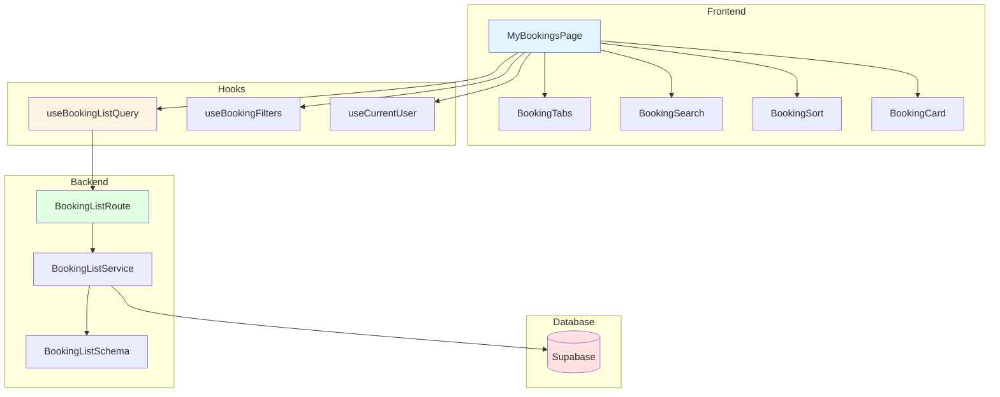

# 예약 내역 목록 페이지 구현 계획

> **페이지 경로**: `/my/bookings`
> **관련 유스케이스**: UC-004 (예약 내역 조회)
> **문서 버전**: 1.0
> **작성일**: 2025-10-16

---

## 개요

예약 내역 목록 페이지는 사용자가 자신의 콘서트 예약 내역을 확인하고 관리할 수 있는 페이지입니다. 상태별 필터링, 검색, 정렬 기능을 제공합니다.

### 주요 기능
- 예약 내역 목록 조회
- 상태별 필터 (예정/지난 공연/취소)
- 콘서트명 검색
- 정렬 (날짜순, 최신 예약순)
- D-day 계산 및 표시

---

## 모듈 목록

### Backend Modules

| 모듈명 | 위치 | 설명 |
|--------|------|------|
| **BookingListService** | `src/features/bookings/backend/service.ts` | 예약 목록 조회 로직 |
| **BookingListRoute** | `src/features/bookings/backend/route.ts` | GET `/api/my/bookings` |
| **BookingListSchema** | `src/features/bookings/backend/schema.ts` | 목록 응답 스키마 |

### Frontend Modules

| 모듈명 | 위치 | 설명 |
|--------|------|------|
| **MyBookingsPage** | `src/app/(protected)/my/bookings/page.tsx` | 메인 페이지 |
| **BookingCard** | `src/features/bookings/components/booking-card.tsx` | 예약 카드 UI |
| **BookingTabs** | `src/features/bookings/components/booking-tabs.tsx` | 상태별 탭 |
| **BookingSearch** | `src/features/bookings/components/booking-search.tsx` | 검색창 |
| **BookingSort** | `src/features/bookings/components/booking-sort.tsx` | 정렬 드롭다운 |
| **useBookingListQuery** | `src/features/bookings/hooks/use-booking-list-query.ts` | 목록 조회 훅 |
| **useBookingFilters** | `src/features/bookings/hooks/use-booking-filters.ts` | 필터 상태 관리 |

---

## 다이어그램

### 모듈 관계도



---

## Implementation Plan

### 1. Backend - BookingListSchema

```typescript
// src/features/bookings/backend/schema.ts

export const BookingListQuerySchema = z.object({
  status: z.enum(['upcoming', 'past', 'cancelled']).optional(),
  search: z.string().optional(),
  sortBy: z.enum(['date', 'recent']).default('date'),
  page: z.coerce.number().int().positive().default(1),
  limit: z.coerce.number().int().min(1).max(50).default(10),
});

export type BookingListQuery = z.infer<typeof BookingListQuerySchema>;

export const BookingItemSchema = z.object({
  id: z.string().uuid(),
  bookingNumber: z.string(),
  status: z.enum(['confirmed', 'cancelled']),
  concertTitle: z.string(),
  concertDate: z.string(),
  concertTime: z.string(),
  posterUrl: z.string().nullable(),
  venueName: z.string(),
  seatCount: z.number().int(),
  seatNumbers: z.array(z.string()),
  totalPrice: z.number().int(),
  createdAt: z.string(),
  dDay: z.number().int().nullable(),
});

export type BookingItem = z.infer<typeof BookingItemSchema>;

export const BookingListResponseSchema = z.object({
  bookings: z.array(BookingItemSchema),
  total: z.number().int(),
  page: z.number().int(),
  limit: z.number().int(),
  hasMore: z.boolean(),
  counts: z.object({
    upcoming: z.number().int(),
    past: z.number().int(),
    cancelled: z.number().int(),
  }),
});

export type BookingListResponse = z.infer<typeof BookingListResponseSchema>;
```

### 2. Backend - BookingListService

```typescript
// src/features/bookings/backend/service.ts

export async function getBookingList(
  supabase: SupabaseClient,
  userId: string,
  query: BookingListQuery
): Promise<HandlerResult<BookingListResponse, BookingServiceError, unknown>> {
  try {
    const { status, search, sortBy, page, limit } = query;
    const offset = (page - 1) * limit;

    let dbQuery = supabase
      .from('bookings')
      .select(`
        id,
        booking_number,
        status,
        created_at,
        concert_schedules!inner(
          concert_date,
          concert_time,
          concerts!inner(title, poster_url, venues!inner(name))
        ),
        booking_seats!inner(seats!inner(seat_number, price))
      `, { count: 'exact' })
      .eq('user_id', userId);

    // 상태별 필터
    const today = new Date().toISOString().split('T')[0];
    if (status === 'upcoming') {
      dbQuery = dbQuery
        .eq('status', 'confirmed')
        .gte('concert_schedules.concert_date', today);
    } else if (status === 'past') {
      dbQuery = dbQuery
        .eq('status', 'confirmed')
        .lt('concert_schedules.concert_date', today);
    } else if (status === 'cancelled') {
      dbQuery = dbQuery.eq('status', 'cancelled');
    }

    // 검색
    if (search) {
      dbQuery = dbQuery.ilike('concert_schedules.concerts.title', `%${search}%`);
    }

    // 정렬
    if (sortBy === 'date') {
      dbQuery = dbQuery.order('concert_schedules.concert_date', {
        ascending: status === 'past' ? false : true,
      });
    } else {
      dbQuery = dbQuery.order('created_at', { ascending: false });
    }

    // 페이지네이션
    dbQuery = dbQuery.range(offset, offset + limit - 1);

    const { data, error, count } = await dbQuery;

    if (error) throw error;

    // 상태별 카운트 조회
    const [upcomingCount, pastCount, cancelledCount] = await Promise.all([
      supabase.from('bookings').select('id', { count: 'exact', head: true })
        .eq('user_id', userId).eq('status', 'confirmed')
        .gte('concert_schedules.concert_date', today),
      supabase.from('bookings').select('id', { count: 'exact', head: true })
        .eq('user_id', userId).eq('status', 'confirmed')
        .lt('concert_schedules.concert_date', today),
      supabase.from('bookings').select('id', { count: 'exact', head: true })
        .eq('user_id', userId).eq('status', 'cancelled'),
    ]);

    const bookings: BookingItem[] = data?.map(row => {
      const concertDate = new Date(row.concert_schedules.concert_date);
      const dDay = status === 'upcoming'
        ? Math.floor((concertDate.getTime() - Date.now()) / (1000 * 60 * 60 * 24))
        : null;

      return {
        id: row.id,
        bookingNumber: row.booking_number,
        status: row.status,
        concertTitle: row.concert_schedules.concerts.title,
        concertDate: row.concert_schedules.concert_date,
        concertTime: row.concert_schedules.concert_time,
        posterUrl: row.concert_schedules.concerts.poster_url,
        venueName: row.concert_schedules.concerts.venues.name,
        seatCount: row.booking_seats.length,
        seatNumbers: row.booking_seats.map((bs: any) => bs.seats.seat_number),
        totalPrice: row.booking_seats.reduce((sum: number, bs: any) => sum + bs.seats.price, 0),
        createdAt: row.created_at,
        dDay,
      };
    }) || [];

    return success({
      bookings,
      total: count ?? 0,
      page,
      limit,
      hasMore: offset + limit < (count ?? 0),
      counts: {
        upcoming: upcomingCount.count ?? 0,
        past: pastCount.count ?? 0,
        cancelled: cancelledCount.count ?? 0,
      },
    });
  } catch (error) {
    return failure(500, 'INTERNAL_ERROR', '예약 목록 조회 중 오류가 발생했습니다.', { error });
  }
}
```

### 3. Frontend - useBookingFilters

```typescript
// src/features/bookings/hooks/use-booking-filters.ts

import { useRouter, useSearchParams } from 'next/navigation';
import { useMemo, useCallback } from 'react';

export interface BookingFilters {
  status: 'upcoming' | 'past' | 'cancelled' | null;
  search: string;
  sortBy: 'date' | 'recent';
  page: number;
}

export function useBookingFilters() {
  const router = useRouter();
  const searchParams = useSearchParams();

  const filters = useMemo<BookingFilters>(() => ({
    status: (searchParams.get('status') as any) || 'upcoming',
    search: searchParams.get('search') || '',
    sortBy: (searchParams.get('sortBy') as any) || 'date',
    page: searchParams.get('page') ? Number(searchParams.get('page')) : 1,
  }), [searchParams]);

  const setFilters = useCallback((newFilters: Partial<BookingFilters>) => {
    const params = new URLSearchParams(searchParams.toString());

    Object.entries(newFilters).forEach(([key, value]) => {
      if (value === null || value === '') {
        params.delete(key);
      } else {
        params.set(key, String(value));
      }
    });

    if (!('page' in newFilters)) {
      params.set('page', '1');
    }

    router.push(`/my/bookings?${params.toString()}`);
  }, [router, searchParams]);

  return { filters, setFilters };
}
```

### 4. Frontend - MyBookingsPage

```typescript
// src/app/(protected)/my/bookings/page.tsx
'use client';

import { useCurrentUser } from '@/features/auth/hooks/useCurrentUser';
import { useBookingListQuery } from '@/features/bookings/hooks/use-booking-list-query';
import { useBookingFilters } from '@/features/bookings/hooks/use-booking-filters';
import { useDebounce } from '@/hooks/use-debounce';
import BookingTabs from '@/features/bookings/components/booking-tabs';
import BookingSearch from '@/features/bookings/components/booking-search';
import BookingSort from '@/features/bookings/components/booking-sort';
import BookingCard from '@/features/bookings/components/booking-card';
import EmptyState from '@/components/shared/empty-state';
import Pagination from '@/components/shared/pagination';

export default function MyBookingsPage() {
  const { user } = useCurrentUser();
  const { filters, setFilters } = useBookingFilters();
  const debouncedSearch = useDebounce(filters.search, 300);

  const { data, isLoading, error } = useBookingListQuery({
    ...filters,
    search: debouncedSearch,
  });

  if (error) {
    return <div>예약 내역을 불러오는 중 오류가 발생했습니다.</div>;
  }

  return (
    <div className="container py-8">
      <h1 className="text-3xl font-bold mb-8">예약 내역</h1>

      <BookingTabs
        counts={data?.counts}
        currentStatus={filters.status || 'upcoming'}
        onChange={(status) => setFilters({ status })}
      />

      <div className="flex justify-between items-center my-6">
        <BookingSearch
          value={filters.search}
          onChange={(search) => setFilters({ search })}
        />
        <BookingSort
          value={filters.sortBy}
          onChange={(sortBy) => setFilters({ sortBy })}
        />
      </div>

      {isLoading ? (
        <div>로딩 중...</div>
      ) : data?.bookings.length === 0 ? (
        <EmptyState
          title="예약 내역이 없습니다"
          description="콘서트를 둘러보고 예약해보세요"
          action={{
            label: '콘서트 둘러보기',
            onClick: () => window.location.href = '/concerts',
          }}
        />
      ) : (
        <>
          <div className="space-y-4">
            {data?.bookings.map((booking) => (
              <BookingCard key={booking.id} booking={booking} />
            ))}
          </div>

          {data && data.hasMore && (
            <div className="mt-8">
              <Pagination
                currentPage={filters.page}
                totalPages={Math.ceil(data.total / 10)}
                onPageChange={(page) => setFilters({ page })}
              />
            </div>
          )}
        </>
      )}
    </div>
  );
}
```

### 5. Frontend - BookingCard

```typescript
// src/features/bookings/components/booking-card.tsx

import Link from 'next/link';
import Image from 'next/image';
import { BookingItem } from '../lib/dto';
import { format } from 'date-fns';
import { ko } from 'date-fns/locale';

export default function BookingCard({ booking }: { booking: BookingItem }) {
  return (
    <Link href={`/my/bookings/${booking.id}`}>
      <div className="border rounded-lg p-4 hover:shadow-lg transition flex gap-4">
        <div className="relative w-24 h-32 flex-shrink-0">
          <Image
            src={booking.posterUrl || 'https://picsum.photos/200/300'}
            alt={booking.concertTitle}
            fill
            className="object-cover rounded"
          />
        </div>

        <div className="flex-1">
          <div className="flex justify-between items-start mb-2">
            <h3 className="font-bold text-lg">{booking.concertTitle}</h3>
            {booking.dDay !== null && booking.dDay >= 0 && (
              <span className="px-2 py-1 bg-primary text-white text-sm rounded">
                D-{booking.dDay}
              </span>
            )}
            {booking.status === 'cancelled' && (
              <span className="px-2 py-1 bg-gray-400 text-white text-sm rounded">
                취소됨
              </span>
            )}
          </div>

          <p className="text-sm text-gray-600 mb-1">
            {format(new Date(booking.concertDate), 'yyyy.MM.dd (E)', { locale: ko })} {booking.concertTime}
          </p>
          <p className="text-sm text-gray-600 mb-2">{booking.venueName}</p>
          <p className="text-sm text-gray-600 mb-2">
            좌석: {booking.seatNumbers.join(', ')} ({booking.seatCount}석)
          </p>
          <p className="font-bold">{booking.totalPrice.toLocaleString()}원</p>
        </div>

        <div className="text-sm text-gray-500">
          예약번호: {booking.bookingNumber}
        </div>
      </div>
    </Link>
  );
}
```

---

## QA Sheet

| 시나리오 | 입력 | 기대 결과 |
|---------|------|----------|
| 기본 목록 | 페이지 진입 | "예정" 탭, 날짜순 정렬 |
| 탭 전환 | "지난 공연" 클릭 | 지난 공연 목록 표시 |
| 검색 | "아이유" 입력 | 검색 결과 표시 (300ms 디바운싱) |
| 정렬 변경 | "최신 예약순" 선택 | 최신 예약순 정렬 |
| 빈 상태 | 예약 없음 | 빈 상태 메시지 |
| D-day 표시 | 예정 예약 | D-3 배지 표시 |

---

## 구현 순서

1. **Backend** (1~2일)
   - [ ] BookingListSchema, BookingListService, Route

2. **Frontend Hooks** (1일)
   - [ ] useBookingListQuery, useBookingFilters

3. **UI 컴포넌트** (1~2일)
   - [ ] BookingCard, BookingTabs, BookingSearch, BookingSort

4. **통합 및 테스트** (1일)

**총 예상 기간**: 3~5일

---

**문서 종료**
