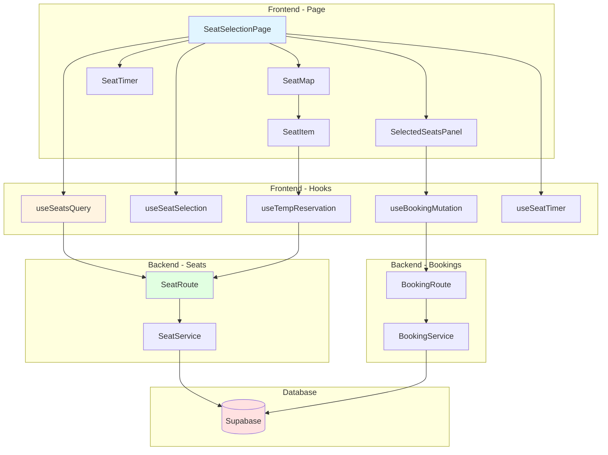
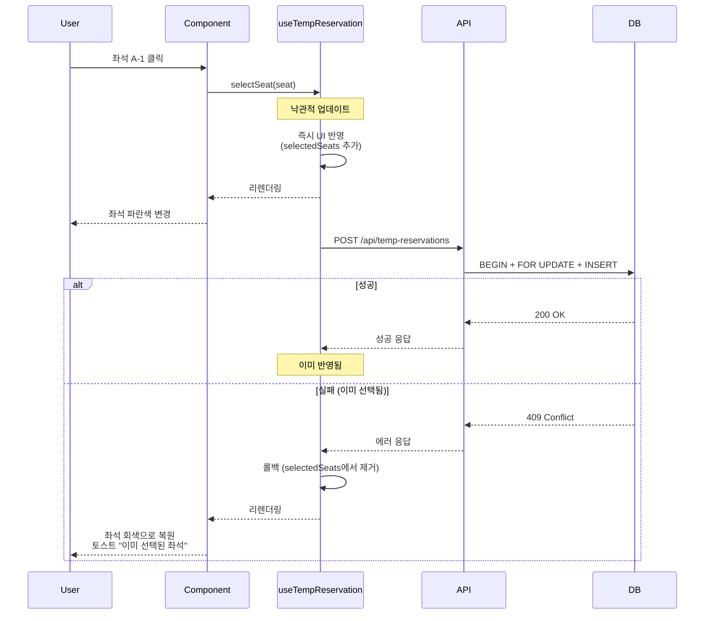

# 좌석 선택 페이지 구현 계획

> **페이지 경로**: `/concerts/[id]/seats?scheduleId=[scheduleId]`
> **관련 유스케이스**: UC-003 (좌석 선택 및 예약)
> **문서 버전**: 1.0
> **작성일**: 2025-10-16

---

## 개요

좌석 선택 페이지는 사용자가 콘서트홀의 좌석을 시각적으로 확인하고 선택하여 예약을 생성하는 핵심 페이지입니다. 10분 타이머, 실시간 동기화, 낙관적 업데이트 등 복잡한 상태 관리가 필요합니다.

### 주요 기능
- 좌석도 조회 및 시각화
- 좌석 선택/해제 (최대 4석)
- 임시 예약 생성 (10분 타이머)
- 실시간 좌석 상태 동기화 (5초 폴링)
- 예약 생성 및 완료 페이지 이동

---

## 모듈 목록

### Backend Modules

| 모듈명 | 위치 | 설명 |
|--------|------|------|
| **SeatService** | `src/features/seats/backend/service.ts` | 좌석 조회, 임시 예약 로직 |
| **SeatRoute** | `src/features/seats/backend/route.ts` | GET `/api/seats`, POST `/api/temp-reservations` |
| **BookingService** | `src/features/bookings/backend/service.ts` | 예약 생성 로직 |
| **BookingRoute** | `src/features/bookings/backend/route.ts` | POST `/api/bookings` |
| **SeatSchema** | `src/features/seats/backend/schema.ts` | 좌석 관련 스키마 |
| **BookingSchema** | `src/features/bookings/backend/schema.ts` | 예약 스키마 |

### Frontend Modules

| 모듈명 | 위치 | 설명 |
|--------|------|------|
| **SeatSelectionPage** | `src/app/concerts/[id]/seats/page.tsx` | 메인 페이지 |
| **SeatMap** | `src/features/seats/components/seat-map.tsx` | 좌석도 렌더링 |
| **SeatItem** | `src/features/seats/components/seat-item.tsx` | 개별 좌석 |
| **SelectedSeatsPanel** | `src/features/seats/components/selected-seats-panel.tsx` | 선택 좌석 패널 |
| **SeatTimer** | `src/features/seats/components/seat-timer.tsx` | 10분 타이머 |
| **useSeatsQuery** | `src/features/seats/hooks/use-seats-query.ts` | 좌석 목록 조회 |
| **useSeatSelection** | `src/features/seats/hooks/use-seat-selection.ts` | 좌석 선택 상태 관리 |
| **useTempReservation** | `src/features/seats/hooks/use-temp-reservation.ts` | 임시 예약 mutation |
| **useBookingMutation** | `src/features/bookings/hooks/use-booking-mutation.ts` | 예약 생성 mutation |
| **useSeatTimer** | `src/features/seats/hooks/use-seat-timer.ts` | 타이머 관리 |

---

## 다이어그램

### 모듈 관계도



### 데이터 흐름 (낙관적 업데이트)



---

## Implementation Plan

### 1. Backend - SeatService

```typescript
// src/features/seats/backend/service.ts

export const SeatSchema = z.object({
  id: z.string().uuid(),
  seatNumber: z.string(),
  seatGrade: z.string(),
  price: z.number().int(),
  positionX: z.number().int().nullable(),
  positionY: z.number().int().nullable(),
  status: z.enum(['available', 'temp_reserved', 'reserved', 'unavailable']),
});

export type Seat = z.infer<typeof SeatSchema>;

// 좌석 목록 조회
export async function getSeats(
  supabase: SupabaseClient,
  scheduleId: string
): Promise<HandlerResult<Seat[], SeatServiceError, unknown>> {
  try {
    const { data, error } = await supabase
      .from('seats')
      .select('*')
      .eq('concert_schedule_id', scheduleId)
      .order('seat_number');

    if (error) throw error;

    const seats: Seat[] = data.map(row => ({
      id: row.id,
      seatNumber: row.seat_number,
      seatGrade: row.seat_grade,
      price: row.price,
      positionX: row.position_x,
      positionY: row.position_y,
      status: row.status,
    }));

    return success(seats);
  } catch (error) {
    return failure(500, 'INTERNAL_ERROR', '좌석 목록 조회 중 오류가 발생했습니다.', { error });
  }
}

// 임시 예약 생성
export async function createTempReservation(
  supabase: SupabaseClient,
  userId: string,
  seatId: string
): Promise<HandlerResult<{ success: boolean }, SeatServiceError, unknown>> {
  try {
    const { error: txError } = await supabase.rpc('create_temp_reservation', {
      p_user_id: userId,
      p_seat_id: seatId,
    });

    if (txError) {
      if (txError.code === '23505') {
        return failure(409, 'SEAT_ALREADY_RESERVED', '이미 선택된 좌석입니다.');
      }
      throw txError;
    }

    return success({ success: true });
  } catch (error) {
    return failure(500, 'INTERNAL_ERROR', '임시 예약 생성 중 오류가 발생했습니다.', { error });
  }
}

// Supabase Function (RPC)
/*
CREATE OR REPLACE FUNCTION create_temp_reservation(p_user_id uuid, p_seat_id uuid)
RETURNS void AS $$
BEGIN
  -- 좌석 상태 확인 (FOR UPDATE)
  PERFORM * FROM seats WHERE id = p_seat_id AND status = 'available' FOR UPDATE;

  IF NOT FOUND THEN
    RAISE EXCEPTION 'SEAT_NOT_AVAILABLE';
  END IF;

  -- 임시 예약 생성
  INSERT INTO temp_reservations (user_id, seat_id, expires_at)
  VALUES (p_user_id, p_seat_id, NOW() + INTERVAL '10 minutes');

  -- 좌석 상태 변경
  UPDATE seats SET status = 'temp_reserved' WHERE id = p_seat_id;
END;
$$ LANGUAGE plpgsql;
*/
```

### 2. Backend - BookingService

```typescript
// src/features/bookings/backend/service.ts

export async function createBooking(
  supabase: SupabaseClient,
  userId: string,
  scheduleId: string
): Promise<HandlerResult<{ bookingId: string; bookingNumber: string }, BookingServiceError, unknown>> {
  try {
    const { data, error } = await supabase.rpc('create_booking_transaction', {
      p_user_id: userId,
      p_schedule_id: scheduleId,
    });

    if (error) throw error;

    return success({
      bookingId: data.booking_id,
      bookingNumber: data.booking_number,
    });
  } catch (error) {
    return failure(500, 'INTERNAL_ERROR', '예약 생성 중 오류가 발생했습니다.', { error });
  }
}

// Supabase Function
/*
CREATE OR REPLACE FUNCTION create_booking_transaction(p_user_id uuid, p_schedule_id uuid)
RETURNS json AS $$
DECLARE
  v_booking_id uuid;
  v_booking_number text;
  v_seat_count int;
BEGIN
  -- 예약 번호 생성
  v_booking_number := 'BK-' || UPPER(substring(md5(random()::text) from 1 for 8));

  -- 예약 생성
  INSERT INTO bookings (user_id, concert_schedule_id, booking_number)
  VALUES (p_user_id, p_schedule_id, v_booking_number)
  RETURNING id INTO v_booking_id;

  -- 임시 예약 → 정식 예약
  INSERT INTO booking_seats (booking_id, seat_id)
  SELECT v_booking_id, seat_id
  FROM temp_reservations
  WHERE user_id = p_user_id;

  GET DIAGNOSTICS v_seat_count = ROW_COUNT;

  -- 좌석 상태 변경
  UPDATE seats SET status = 'reserved'
  WHERE id IN (SELECT seat_id FROM temp_reservations WHERE user_id = p_user_id);

  -- 임시 예약 삭제
  DELETE FROM temp_reservations WHERE user_id = p_user_id;

  -- 예매 가능 좌석 수 업데이트
  UPDATE concert_schedules
  SET available_seats = available_seats - v_seat_count,
      is_sold_out = (available_seats - v_seat_count = 0)
  WHERE id = p_schedule_id;

  RETURN json_build_object(
    'booking_id', v_booking_id,
    'booking_number', v_booking_number
  );
END;
$$ LANGUAGE plpgsql;
*/
```

### 3. Frontend - useSeatSelection

```typescript
// src/features/seats/hooks/use-seat-selection.ts

import { create } from 'zustand';
import { Seat } from '../lib/dto';

interface SeatSelectionState {
  selectedSeats: Seat[];
  addSeat: (seat: Seat) => boolean;
  removeSeat: (seatId: string) => void;
  clearSeats: () => void;
  getTotalPrice: () => number;
  isMaxReached: () => boolean;
}

export const useSeatSelection = create<SeatSelectionState>((set, get) => ({
  selectedSeats: [],

  addSeat: (seat: Seat) => {
    const { selectedSeats } = get();
    if (selectedSeats.length >= 4) {
      return false; // 최대 4석
    }
    if (selectedSeats.some(s => s.id === seat.id)) {
      return false; // 중복
    }
    set({ selectedSeats: [...selectedSeats, seat] });
    return true;
  },

  removeSeat: (seatId: string) => {
    set(state => ({
      selectedSeats: state.selectedSeats.filter(s => s.id !== seatId),
    }));
  },

  clearSeats: () => set({ selectedSeats: [] }),

  getTotalPrice: () => {
    return get().selectedSeats.reduce((sum, seat) => sum + seat.price, 0);
  },

  isMaxReached: () => get().selectedSeats.length >= 4,
}));
```

### 4. Frontend - useSeatTimer

```typescript
// src/features/seats/hooks/use-seat-timer.ts

import { useState, useEffect, useCallback } from 'react';

const TIMER_DURATION = 10 * 60; // 10분 (초)

export function useSeatTimer(onExpire: () => void) {
  const [remainingSeconds, setRemainingSeconds] = useState(TIMER_DURATION);
  const [isExpired, setIsExpired] = useState(false);

  useEffect(() => {
    if (remainingSeconds <= 0) {
      setIsExpired(true);
      onExpire();
      return;
    }

    const timer = setInterval(() => {
      setRemainingSeconds(prev => {
        const next = prev - 1;
        if (next <= 0) {
          clearInterval(timer);
          setIsExpired(true);
          onExpire();
          return 0;
        }
        return next;
      });
    }, 1000);

    return () => clearInterval(timer);
  }, [remainingSeconds, onExpire]);

  const formatTime = useCallback(() => {
    const minutes = Math.floor(remainingSeconds / 60);
    const seconds = remainingSeconds % 60;
    return `${minutes.toString().padStart(2, '0')}:${seconds.toString().padStart(2, '0')}`;
  }, [remainingSeconds]);

  const isWarning = remainingSeconds <= 3 * 60; // 3분 이하
  const isCritical = remainingSeconds <= 1 * 60; // 1분 이하

  return {
    remainingSeconds,
    isExpired,
    formatTime,
    isWarning,
    isCritical,
  };
}
```

### 5. Frontend - SeatSelectionPage

```typescript
// src/app/concerts/[id]/seats/page.tsx
'use client';

import { use, useEffect } from 'react';
import { useSearchParams, useRouter } from 'next/navigation';
import { useCurrentUser } from '@/features/auth/hooks/useCurrentUser';
import { useSeatsQuery } from '@/features/seats/hooks/use-seats-query';
import { useSeatSelection } from '@/features/seats/hooks/use-seat-selection';
import { useSeatTimer } from '@/features/seats/hooks/use-seat-timer';
import { useBookingMutation } from '@/features/bookings/hooks/use-booking-mutation';
import SeatMap from '@/features/seats/components/seat-map';
import SelectedSeatsPanel from '@/features/seats/components/selected-seats-panel';
import SeatTimer from '@/features/seats/components/seat-timer';

export default function SeatSelectionPage({
  params,
}: {
  params: Promise<{ id: string }>;
}) {
  const { id: concertId } = use(params);
  const searchParams = useSearchParams();
  const scheduleId = searchParams.get('scheduleId');
  const router = useRouter();
  const { user } = useCurrentUser();

  const { data: seats, isLoading, refetch } = useSeatsQuery(scheduleId!);
  const { selectedSeats, clearSeats, getTotalPrice } = useSeatSelection();
  const bookingMutation = useBookingMutation();

  const handleTimerExpire = () => {
    alert('시간이 만료되었습니다. 다시 시도해주세요.');
    clearSeats();
    router.push(`/concerts/${concertId}`);
  };

  const timerState = useSeatTimer(handleTimerExpire);

  // 실시간 동기화 (5초 폴링)
  useEffect(() => {
    const interval = setInterval(() => {
      refetch();
    }, 5000);
    return () => clearInterval(interval);
  }, [refetch]);

  // 로그인 체크
  useEffect(() => {
    if (!user) {
      router.push(`/login?redirectedFrom=/concerts/${concertId}/seats?scheduleId=${scheduleId}`);
    }
  }, [user, router, concertId, scheduleId]);

  const handleBooking = async () => {
    if (selectedSeats.length === 0) {
      alert('좌석을 선택해주세요.');
      return;
    }

    if (!confirm('예약하시겠습니까?')) return;

    try {
      const result = await bookingMutation.mutateAsync({
        scheduleId: scheduleId!,
      });
      router.push(`/my/bookings/${result.bookingId}`);
    } catch (error) {
      alert('예약 중 오류가 발생했습니다.');
    }
  };

  if (!scheduleId) {
    router.push(`/concerts/${concertId}`);
    return null;
  }

  if (isLoading) return <div>좌석 정보를 불러오는 중...</div>;

  return (
    <div className="container py-8">
      <SeatTimer timerState={timerState} />

      <div className="grid grid-cols-3 gap-8">
        <div className="col-span-2">
          <SeatMap seats={seats || []} />
        </div>

        <div>
          <SelectedSeatsPanel
            selectedSeats={selectedSeats}
            totalPrice={getTotalPrice()}
            onBooking={handleBooking}
            isBooking={bookingMutation.isPending}
          />
        </div>
      </div>
    </div>
  );
}
```

---

## QA Sheet

| 시나리오 | 입력 | 기대 결과 |
|---------|------|----------|
| 좌석 선택 | 좌석 클릭 | 즉시 파란색 변경, API 성공 |
| 동시 선택 충돌 | 다른 사용자가 선택한 좌석 클릭 | 롤백, 토스트 "이미 선택된 좌석" |
| 최대 선택 초과 | 5번째 좌석 클릭 | 토스트 "최대 4석까지" |
| 타이머 만료 | 10분 경과 | 모달, 콘서트 상세로 리다이렉트 |
| 실시간 동기화 | 5초마다 | 다른 사용자 선택 좌석 회색 변경 |
| 예약 생성 | 예약하기 버튼 | 트랜잭션 성공, 예약 상세로 이동 |

---

## 구현 순서

1. **Backend** (2~3일)
   - [ ] Supabase Functions 작성 (RPC)
   - [ ] SeatService, BookingService 구현
   - [ ] Route 등록

2. **Frontend Hooks** (2일)
   - [ ] useSeatSelection (Zustand)
   - [ ] useSeatTimer
   - [ ] useTempReservation, useBookingMutation

3. **UI 컴포넌트** (2~3일)
   - [ ] SeatMap (SVG 또는 Canvas)
   - [ ] SeatItem, SelectedSeatsPanel, SeatTimer

4. **통합 및 테스트** (1~2일)

**총 예상 기간**: 7~10일

---

**문서 종료**
