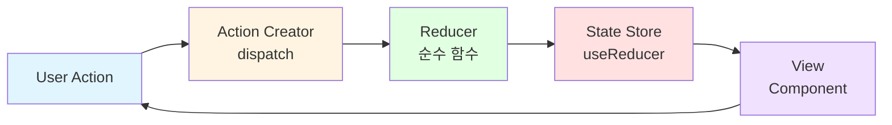
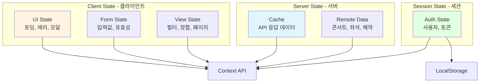
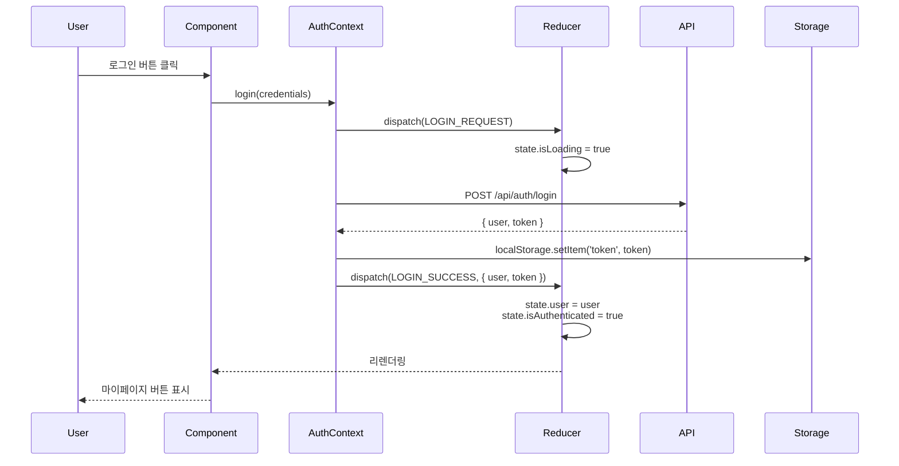
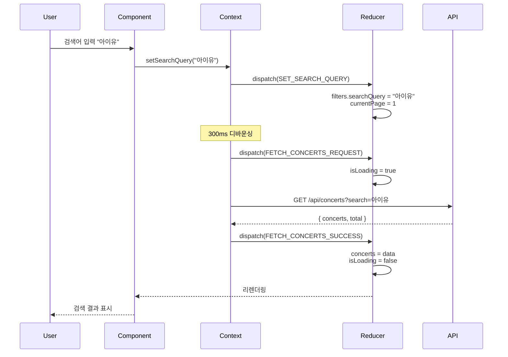
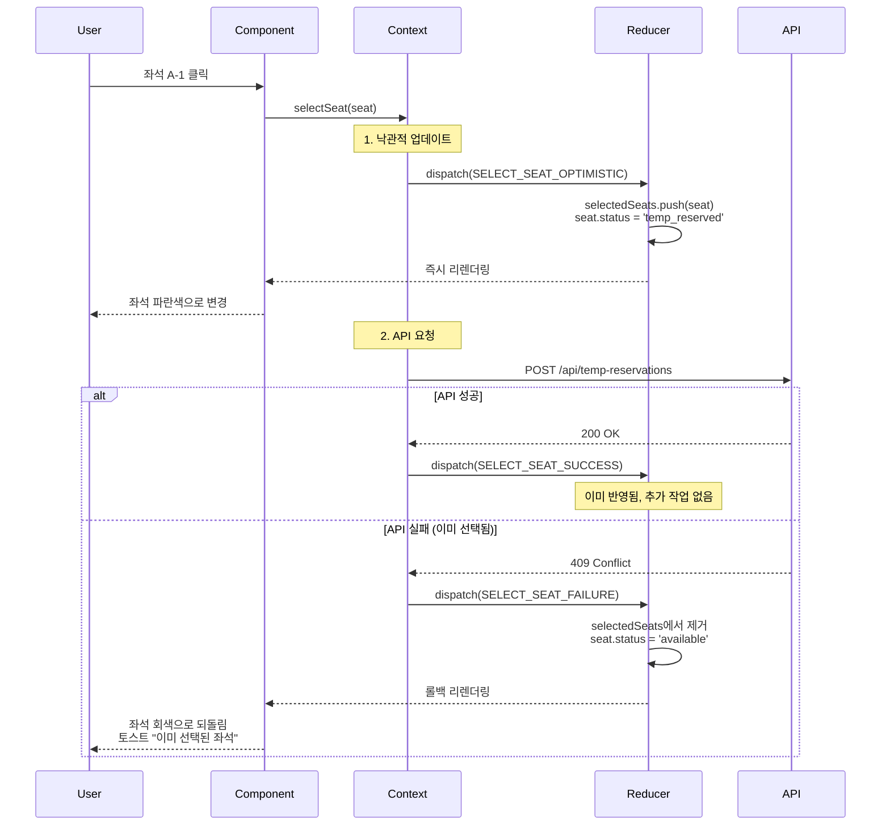
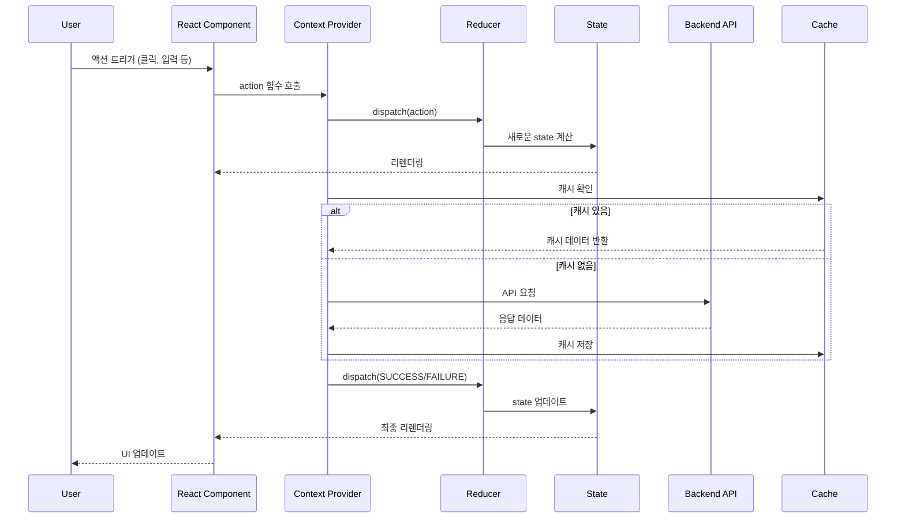
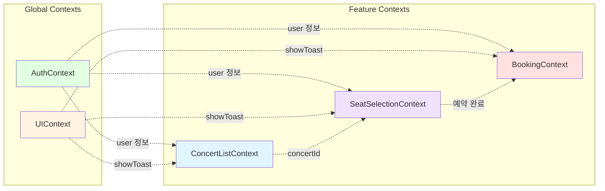

# 콘서트 예약 시스템 - 상태 관리 설계서

> 본 문서는 콘서트 예약 시스템의 상태 관리 아키텍처를 종합적으로 정의합니다.
> Context API + useReducer 패턴을 사용하여 Flux 아키텍처를 구현합니다.

**문서 버전**: 1.0
**작성일**: 2025-10-16
**최종 수정일**: 2025-10-16
**기술 스택**: React 18+, TypeScript, Context API, useReducer

---

## 목차

1. [아키텍처 개요](#1-아키텍처-개요)
2. [상태 관리 전략](#2-상태-관리-전략)
3. [Context 구조](#3-context-구조)
4. [AuthContext - 인증 관리](#4-authcontext---인증-관리)
5. [ConcertListContext - 콘서트 목록](#5-concertlistcontext---콘서트-목록)
6. [SeatSelectionContext - 좌석 선택](#6-seatselectioncontext---좌석-선택)
7. [BookingContext - 예약 관리](#7-bookingcontext---예약-관리)
8. [UIContext - 전역 UI 상태](#8-uicontext---전역-ui-상태)
9. [데이터 흐름 및 통신](#9-데이터-흐름-및-통신)

---

## 1. 아키텍처 개요

### 1.1 Flux 아키텍처 패턴



### 1.2 Context 계층 구조

```mermaid
graph TB
    ROOT[App Root]

    subgraph "Global Layer"
        AUTH[AuthContext<br/>인증 상태]
        UI[UIContext<br/>Toast, Loading]
    end

    subgraph "Feature Layer"
        CONCERT[ConcertListContext<br/>콘서트 목록]
        SEAT[SeatSelectionContext<br/>좌석 선택]
        BOOKING[BookingContext<br/>예약 관리]
    end

    subgraph "Page Layer"
        P1[/concerts]
        P2[/concerts/[id]/seats]
        P3[/my/bookings]
    end

    ROOT --> AUTH
    ROOT --> UI

    AUTH --> CONCERT
    AUTH --> SEAT
    AUTH --> BOOKING

    UI --> CONCERT
    UI --> SEAT
    UI --> BOOKING

    CONCERT --> P1
    SEAT --> P2
    BOOKING --> P3

    style AUTH fill:#e1ffe1
    style UI fill:#fff4e1
    style CONCERT fill:#e1f5ff
    style SEAT fill:#f0e1ff
    style BOOKING fill:#ffe1e1
```

### 1.3 설계 원칙

| 원칙 | 설명 | 적용 방법 |
|------|------|----------|
| **단일 책임** | 각 Context는 하나의 도메인만 관리 | 인증, 콘서트, 좌석, 예약 등 분리 |
| **단방향 데이터 흐름** | Action → Reducer → State → View | Flux 패턴 준수 |
| **불변성** | State는 직접 변경하지 않음 | Reducer에서 새 객체 반환 |
| **타입 안정성** | TypeScript로 모든 타입 정의 | Interface 기반 설계 |
| **성능 최적화** | 불필요한 리렌더링 방지 | useMemo, useCallback 활용 |
| **에러 바운더리** | Context 사용 전 검증 | Custom Hook에서 체크 |

---

## 2. 상태 관리 전략

### 2.1 상태 분류



### 2.2 상태 관리 도구 선택

| 상태 타입 | 관리 도구 | 이유 |
|----------|----------|------|
| **전역 상태** | Context API + useReducer | React 내장, 간단한 전역 상태 관리 |
| **UI 상태** | Context API (UIContext) | Toast, 로딩 등 전역 UI 상태 |
| **폼 상태** | 로컬 useState + Reducer | 페이지별 로컬 관리, 복잡한 폼은 Reducer |
| **서버 상태** | Context + 수동 캐싱 | API 데이터를 Context에서 관리 |
| **세션 상태** | Context + LocalStorage | 인증 정보 영속화 |

### 2.3 관리해야 할 상태 목록

| 카테고리 | 상태명 | Context | 설명 |
|---------|--------|---------|------|
| **인증** | `user` | AuthContext | 로그인한 사용자 정보 |
| **인증** | `isAuthenticated` | AuthContext | 인증 여부 |
| **인증** | `token` | AuthContext | JWT 토큰 |
| **목록** | `concerts` | ConcertListContext | 콘서트 목록 데이터 |
| **목록** | `searchQuery` | ConcertListContext | 검색어 |
| **목록** | `filters` | ConcertListContext | 필터 조건들 |
| **목록** | `sortBy` | ConcertListContext | 정렬 기준 |
| **목록** | `currentPage` | ConcertListContext | 현재 페이지 |
| **좌석** | `seats` | SeatSelectionContext | 좌석 목록 |
| **좌석** | `selectedSeats` | SeatSelectionContext | 선택된 좌석 배열 |
| **좌석** | `remainingTime` | SeatSelectionContext | 타이머 (초) |
| **좌석** | `zoom` | SeatSelectionContext | 줌 레벨 & 위치 |
| **예약** | `bookings` | BookingContext | 예약 내역 목록 |
| **예약** | `statusFilter` | BookingContext | 상태 필터 |
| **예약** | `cancelModal` | BookingContext | 취소 모달 상태 |
| **UI** | `toasts` | UIContext | 토스트 메시지 배열 |
| **UI** | `isGlobalLoading` | UIContext | 전역 로딩 상태 |

### 2.4 화면에 보이지만 상태가 아닌 데이터

| 데이터명 | 계산 방식 | 사용처 |
|---------|----------|--------|
| `totalPrice` | `selectedSeats.reduce((sum, s) => sum + s.price, 0)` | 좌석 선택 패널 |
| `dDay` | `Math.floor((concertDate - now) / 86400000)` | 예약 내역 카드 |
| `isCancellable` | `status === 'confirmed' && concertDate > now && ...` | 취소 버튼 활성화 |
| `formattedTime` | `formatTime(remainingSeconds)` | 타이머 표시 |
| `hasActiveFilters` | `filters.genre || filters.dateRange || ...` | 필터 초기화 버튼 |

---

## 3. Context 구조

### 3.1 Context 목록

```typescript
// 전역 Context
export const AuthContext = createContext<AuthContextValue | undefined>(undefined);
export const UIContext = createContext<UIContextValue | undefined>(undefined);

// 기능별 Context
export const ConcertListContext = createContext<ConcertListContextValue | undefined>(undefined);
export const SeatSelectionContext = createContext<SeatSelectionContextValue | undefined>(undefined);
export const BookingContext = createContext<BookingContextValue | undefined>(undefined);
```

### 3.2 Provider 계층 구조

```typescript
// app/layout.tsx
export default function RootLayout({ children }) {
  return (
    <html>
      <body>
        <AuthProvider>
          <UIProvider>
            {children}
          </UIProvider>
        </AuthProvider>
      </body>
    </html>
  );
}

// app/concerts/layout.tsx
export default function ConcertsLayout({ children }) {
  return (
    <ConcertListProvider>
      {children}
    </ConcertListProvider>
  );
}

// app/concerts/[id]/seats/page.tsx
export default function SeatSelectionPage({ params }) {
  return (
    <SeatSelectionProvider concertId={params.id}>
      <SeatSelectionUI />
    </SeatSelectionProvider>
  );
}

// app/my/bookings/layout.tsx
export default function BookingsLayout({ children }) {
  return (
    <BookingProvider>
      {children}
    </BookingProvider>
  );
}
```

### 3.3 Custom Hook 패턴

```typescript
// hooks/useAuth.ts
export function useAuth() {
  const context = useContext(AuthContext);
  if (!context) {
    throw new Error('useAuth must be used within AuthProvider');
  }
  return context;
}

// hooks/useConcertList.ts
export function useConcertList() {
  const context = useContext(ConcertListContext);
  if (!context) {
    throw new Error('useConcertList must be used within ConcertListProvider');
  }
  return context;
}

// 컴포넌트에서 사용
function MyComponent() {
  const { user, login, logout } = useAuth();
  const { concerts, fetchConcerts } = useConcertList();

  // ...
}
```

---

## 4. AuthContext - 인증 관리

### 4.1 State 인터페이스

```typescript
interface AuthState {
  user: User | null;
  isAuthenticated: boolean;
  isLoading: boolean;
  isInitializing: boolean;
  error: string | null;
  token: string | null;
  expiresAt: Date | null;
}

interface User {
  id: string;
  email: string;
  name: string;
  phoneNumber: string;
  createdAt: Date;
}
```

### 4.2 Action 타입

```typescript
type AuthAction =
  | { type: 'INITIALIZE_REQUEST' }
  | { type: 'INITIALIZE_SUCCESS'; payload: { user: User; token: string; expiresAt: Date } }
  | { type: 'INITIALIZE_FAILURE' }
  | { type: 'LOGIN_REQUEST' }
  | { type: 'LOGIN_SUCCESS'; payload: { user: User; token: string; expiresAt: Date } }
  | { type: 'LOGIN_FAILURE'; payload: string }
  | { type: 'LOGOUT' }
  | { type: 'SESSION_EXPIRED' }
  | { type: 'UPDATE_USER'; payload: Partial<User> };
```

### 4.3 Reducer 로직

```typescript
export function authReducer(state: AuthState, action: AuthAction): AuthState {
  switch (action.type) {
    case 'LOGIN_REQUEST':
      return { ...state, isLoading: true, error: null };

    case 'LOGIN_SUCCESS':
      return {
        ...state,
        user: action.payload.user,
        token: action.payload.token,
        expiresAt: action.payload.expiresAt,
        isAuthenticated: true,
        isLoading: false,
        error: null,
      };

    case 'LOGIN_FAILURE':
      return {
        ...state,
        user: null,
        isAuthenticated: false,
        isLoading: false,
        error: action.payload,
      };

    case 'LOGOUT':
    case 'SESSION_EXPIRED':
      return {
        ...initialAuthState,
      };

    default:
      return state;
  }
}
```

### 4.4 Context Value (노출 API)

```typescript
interface AuthContextValue {
  // State
  state: AuthState;

  // Computed Values
  isLoggedIn: boolean;
  userName: string | null;

  // Actions
  login: (credentials: { email: string; password: string }) => Promise<void>;
  logout: () => Promise<void>;
  register: (data: RegisterData) => Promise<void>;
  updateProfile: (data: Partial<User>) => Promise<void>;

  // Utilities
  checkSession: () => boolean;
  refreshToken: () => Promise<void>;
}
```

### 4.5 데이터 흐름



### 4.6 하위 컴포넌트 노출 API

| 이름 | 타입 | 설명 | 사용 예시 |
|------|------|------|----------|
| `user` | `User \| null` | 현재 사용자 정보 | `{user?.name}` |
| `isAuthenticated` | `boolean` | 인증 여부 | `if (isAuthenticated) { ... }` |
| `isLoading` | `boolean` | 로그인 처리 중 | `{isLoading && <Spinner />}` |
| `login(credentials)` | `Promise<void>` | 로그인 실행 | 로그인 폼 제출 |
| `logout()` | `Promise<void>` | 로그아웃 실행 | 로그아웃 버튼 클릭 |
| `checkSession()` | `boolean` | 세션 유효성 확인 | 페이지 진입 시 |

---

## 5. ConcertListContext - 콘서트 목록

### 5.1 State 인터페이스

```typescript
interface ConcertListState {
  concerts: Concert[];
  totalCount: number;

  filters: {
    searchQuery: string;
    genre: string | null;
    dateRange: { start: Date; end: Date } | null;
    region: string | null;
    priceRange: { min: number; max: number } | null;
  };

  sortBy: 'latest' | 'popularity' | 'price';
  currentPage: number;
  pageSize: number;
  hasMore: boolean;

  isLoading: boolean;
  isLoadingMore: boolean;
  error: string | null;

  lastFetchedAt: Date | null;
}

interface Concert {
  id: string;
  title: string;
  posterUrl: string;
  genre: string;
  performers: string;
  venueName: string;
  nearestDate: Date;
  minPrice: number;
  availableSeats: number;
}
```

### 5.2 Action 타입

```typescript
type ConcertListAction =
  // 필터 액션
  | { type: 'SET_SEARCH_QUERY'; payload: string }
  | { type: 'SET_GENRE_FILTER'; payload: string | null }
  | { type: 'SET_DATE_RANGE_FILTER'; payload: { start: Date; end: Date } | null }
  | { type: 'RESET_FILTERS' }

  // 정렬 & 페이지 액션
  | { type: 'SET_SORT_BY'; payload: 'latest' | 'popularity' | 'price' }
  | { type: 'SET_PAGE'; payload: number }
  | { type: 'NEXT_PAGE' }

  // 데이터 로드 액션
  | { type: 'FETCH_CONCERTS_REQUEST' }
  | { type: 'FETCH_CONCERTS_SUCCESS'; payload: { concerts: Concert[]; total: number; hasMore: boolean } }
  | { type: 'FETCH_CONCERTS_FAILURE'; payload: string }
  | { type: 'LOAD_MORE_SUCCESS'; payload: { concerts: Concert[]; hasMore: boolean } };
```

### 5.3 Reducer 주요 로직

```typescript
export function concertListReducer(state: ConcertListState, action: ConcertListAction): ConcertListState {
  switch (action.type) {
    case 'SET_SEARCH_QUERY':
      return {
        ...state,
        filters: { ...state.filters, searchQuery: action.payload },
        currentPage: 1, // 검색 시 첫 페이지로 리셋
      };

    case 'FETCH_CONCERTS_REQUEST':
      return { ...state, isLoading: true, error: null };

    case 'FETCH_CONCERTS_SUCCESS':
      return {
        ...state,
        concerts: action.payload.concerts,
        totalCount: action.payload.total,
        hasMore: action.payload.hasMore,
        isLoading: false,
        lastFetchedAt: new Date(),
      };

    case 'LOAD_MORE_SUCCESS':
      return {
        ...state,
        concerts: [...state.concerts, ...action.payload.concerts],
        hasMore: action.payload.hasMore,
        isLoadingMore: false,
      };

    case 'RESET_FILTERS':
      return {
        ...state,
        filters: {
          searchQuery: '',
          genre: null,
          dateRange: null,
          region: null,
          priceRange: null,
        },
        currentPage: 1,
      };

    default:
      return state;
  }
}
```

### 5.4 Context Value (노출 API)

```typescript
interface ConcertListContextValue {
  // State
  state: ConcertListState;

  // Computed Values
  filteredCount: number;
  hasActiveFilters: boolean;
  activeFilterTags: FilterTag[];

  // Filter Actions
  setSearchQuery: (query: string) => void;
  setGenreFilter: (genre: string | null) => void;
  setDateRangeFilter: (range: { start: Date; end: Date } | null) => void;
  resetFilters: () => void;

  // Sort & Pagination Actions
  setSortBy: (sortBy: 'latest' | 'popularity' | 'price') => void;
  goToPage: (page: number) => void;
  loadMore: () => Promise<void>;

  // Data Actions
  fetchConcerts: () => Promise<void>;
  refetch: () => Promise<void>;

  // Utilities
  getConcertById: (id: string) => Concert | undefined;
}
```

### 5.5 데이터 흐름



### 5.6 하위 컴포넌트 노출 API

| 이름 | 타입 | 설명 | 사용 예시 |
|------|------|------|----------|
| `concerts` | `Concert[]` | 콘서트 목록 | `concerts.map(c => ...)` |
| `isLoading` | `boolean` | 로딩 중 | `{isLoading && <Skeleton />}` |
| `filters` | `Filters` | 현재 필터 상태 | 필터 UI 값 표시 |
| `setSearchQuery(query)` | `void` | 검색어 설정 | 검색창 onChange |
| `setGenreFilter(genre)` | `void` | 장르 필터 | 장르 선택 |
| `loadMore()` | `Promise<void>` | 다음 페이지 | 더보기 버튼 |
| `hasActiveFilters` | `boolean` | 활성 필터 여부 | 초기화 버튼 표시 |

---

## 6. SeatSelectionContext - 좌석 선택

### 6.1 State 인터페이스

```typescript
interface SeatSelectionState {
  concertId: string | null;
  scheduleId: string | null;
  concertInfo: {
    title: string;
    date: Date;
    time: string;
    venueName: string;
  } | null;

  seats: Seat[];
  selectedSeats: Seat[];

  seatFilter: string | null;
  viewMode: 'map' | 'list';
  zoom: {
    level: number;
    position: { x: number; y: number };
  };

  timer: {
    remainingSeconds: number;
    isExpired: boolean;
    startedAt: Date | null;
  };

  lastSyncedAt: Date | null;
  isLoading: boolean;
  error: string | null;

  modals: {
    confirmBooking: boolean;
    exitWarning: boolean;
  };
}

interface Seat {
  id: string;
  seatNumber: string;
  seatGrade: 'Special' | 'Premium' | 'Advanced' | 'Regular';
  price: number;
  position: { x: number; y: number };
  status: 'available' | 'temp_reserved' | 'reserved' | 'unavailable';
}
```

### 6.2 Action 타입

```typescript
type SeatSelectionAction =
  | { type: 'INITIALIZE'; payload: { concertId: string; scheduleId: string } }
  | { type: 'LOAD_SEATS_SUCCESS'; payload: { seats: Seat[]; concertInfo: any } }

  // 낙관적 업데이트 패턴
  | { type: 'SELECT_SEAT_OPTIMISTIC'; payload: Seat }
  | { type: 'SELECT_SEAT_SUCCESS'; payload: { seatId: string } }
  | { type: 'SELECT_SEAT_FAILURE'; payload: { seatId: string; error: string } }
  | { type: 'REMOVE_SEAT'; payload: string }

  // 타이머
  | { type: 'START_TIMER'; payload: { expiresAt: Date } }
  | { type: 'TICK_TIMER' }
  | { type: 'TIMER_EXPIRED' }

  // 실시간 동기화
  | { type: 'SYNC_SEATS_SUCCESS'; payload: { seats: Seat[] } }
  | { type: 'UPDATE_SEAT_STATUS'; payload: { seatId: string; status: Seat['status'] } }

  // 뷰 제어
  | { type: 'SET_SEAT_FILTER'; payload: string | null }
  | { type: 'SET_ZOOM'; payload: { level: number; position: { x: number; y: number } } };
```

### 6.3 Reducer 주요 로직 (낙관적 업데이트)

```typescript
export function seatSelectionReducer(state: SeatSelectionState, action: SeatSelectionAction): SeatSelectionState {
  switch (action.type) {
    case 'SELECT_SEAT_OPTIMISTIC': {
      const seat = action.payload;

      // 최대 4석 체크
      if (state.selectedSeats.length >= 4) {
        return state;
      }

      // 중복 선택 체크
      if (state.selectedSeats.some(s => s.id === seat.id)) {
        return state;
      }

      // 낙관적 업데이트: 즉시 UI 반영
      return {
        ...state,
        selectedSeats: [...state.selectedSeats, seat],
        seats: state.seats.map(s =>
          s.id === seat.id ? { ...s, status: 'temp_reserved' } : s
        ),
      };
    }

    case 'SELECT_SEAT_FAILURE': {
      // 롤백: 실패 시 이전 상태로 되돌림
      const seatId = action.payload.seatId;
      return {
        ...state,
        selectedSeats: state.selectedSeats.filter(s => s.id !== seatId),
        seats: state.seats.map(s =>
          s.id === seatId ? { ...s, status: 'available' } : s
        ),
      };
    }

    case 'TICK_TIMER': {
      const newSeconds = Math.max(0, state.timer.remainingSeconds - 1);
      return {
        ...state,
        timer: {
          ...state.timer,
          remainingSeconds: newSeconds,
          isExpired: newSeconds === 0,
        },
      };
    }

    case 'TIMER_EXPIRED':
      return {
        ...state,
        selectedSeats: [],
        seats: state.seats.map(s =>
          s.status === 'temp_reserved' ? { ...s, status: 'available' } : s
        ),
        timer: { ...state.timer, isExpired: true },
      };

    default:
      return state;
  }
}
```

### 6.4 Context Value (노출 API)

```typescript
interface SeatSelectionContextValue {
  state: SeatSelectionState;

  // Computed Values
  totalPrice: number;
  selectedSeatsCount: number;
  formattedRemainingTime: string;
  isMaxSelectionReached: boolean;
  isTimeWarning: boolean;
  isTimeCritical: boolean;

  // Seat Actions
  selectSeat: (seat: Seat) => Promise<void>;
  removeSeat: (seatId: string) => Promise<void>;
  clearSelection: () => Promise<void>;

  // View Actions
  setSeatFilter: (grade: string | null) => void;
  zoomIn: () => void;
  zoomOut: () => void;
  panView: (delta: { x: number; y: number }) => void;

  // Sync Actions
  syncSeats: () => Promise<void>;

  // Booking Actions
  confirmBooking: () => Promise<void>;

  // Utilities
  isSeatSelectable: (seat: Seat) => boolean;
}
```

### 6.5 데이터 흐름 (낙관적 업데이트)



### 6.6 타이머 관리

```typescript
// Context Provider 내부
useEffect(() => {
  // 1초마다 TICK_TIMER 디스패치
  const timer = setInterval(() => {
    dispatch({ type: 'TICK_TIMER' });
  }, 1000);

  return () => clearInterval(timer);
}, []);

// 타이머 만료 감지
useEffect(() => {
  if (state.timer.isExpired && state.selectedSeats.length > 0) {
    dispatch({ type: 'TIMER_EXPIRED' });

    // API 호출: 임시 예약 해제
    clearTempReservations();

    // 모달 표시 후 리다이렉트
    showTimeoutModal();
  }
}, [state.timer.isExpired, state.selectedSeats.length]);
```

### 6.7 하위 컴포넌트 노출 API

| 이름 | 타입 | 설명 | 사용 예시 |
|------|------|------|----------|
| `seats` | `Seat[]` | 전체 좌석 목록 | 좌석도 렌더링 |
| `selectedSeats` | `Seat[]` | 선택된 좌석 | 선택 패널 |
| `totalPrice` | `number` | 총 금액 | `{totalPrice.toLocaleString()}원` |
| `formattedRemainingTime` | `string` | "09:45" | 타이머 표시 |
| `isMaxSelectionReached` | `boolean` | 4석 도달 여부 | 선택 불가 안내 |
| `selectSeat(seat)` | `Promise<void>` | 좌석 선택 | 좌석 클릭 |
| `removeSeat(id)` | `Promise<void>` | 좌석 제거 | 삭제 버튼 |
| `confirmBooking()` | `Promise<void>` | 예약 확정 | 예약하기 버튼 |

---

## 7. BookingContext - 예약 관리

### 7.1 State 인터페이스

```typescript
interface BookingState {
  bookings: Booking[];
  totalCount: number;

  statusFilter: 'upcoming' | 'past' | 'cancelled';
  searchQuery: string;
  sortBy: 'date' | 'recent';

  currentPage: number;
  hasMore: boolean;

  selectedBooking: BookingDetail | null;

  cancelModal: {
    isOpen: boolean;
    bookingId: string | null;
    reason: string | null;
    reasonDetail: string;
    isConfirmed: boolean;
    isCancelling: boolean;
  };

  isLoading: boolean;
  error: string | null;
}

interface Booking {
  id: string;
  bookingNumber: string;
  status: 'confirmed' | 'cancelled';
  concertTitle: string;
  concertDate: Date;
  venueName: string;
  seatNumbers: string[];
  totalPrice: number;
  createdAt: Date;
}
```

### 7.2 Action 타입

```typescript
type BookingAction =
  | { type: 'FETCH_BOOKINGS_SUCCESS'; payload: { bookings: Booking[]; total: number } }
  | { type: 'FETCH_BOOKING_DETAIL_SUCCESS'; payload: BookingDetail }

  | { type: 'SET_STATUS_FILTER'; payload: 'upcoming' | 'past' | 'cancelled' }
  | { type: 'SET_SEARCH_QUERY'; payload: string }

  | { type: 'OPEN_CANCEL_MODAL'; payload: string }
  | { type: 'CLOSE_CANCEL_MODAL' }
  | { type: 'SET_CANCEL_REASON'; payload: string | null }
  | { type: 'SET_CANCEL_CONFIRMED'; payload: boolean }
  | { type: 'CANCEL_BOOKING_REQUEST' }
  | { type: 'CANCEL_BOOKING_SUCCESS'; payload: string }
  | { type: 'CANCEL_BOOKING_FAILURE'; payload: string };
```

### 7.3 Reducer 주요 로직

```typescript
export function bookingReducer(state: BookingState, action: BookingAction): BookingState {
  switch (action.type) {
    case 'SET_STATUS_FILTER':
      return {
        ...state,
        statusFilter: action.payload,
        currentPage: 1,
      };

    case 'OPEN_CANCEL_MODAL':
      return {
        ...state,
        cancelModal: {
          isOpen: true,
          bookingId: action.payload,
          reason: null,
          reasonDetail: '',
          isConfirmed: false,
          isCancelling: false,
        },
      };

    case 'CANCEL_BOOKING_SUCCESS': {
      const bookingId = action.payload;
      return {
        ...state,
        bookings: state.bookings.map(b =>
          b.id === bookingId ? { ...b, status: 'cancelled', cancelledAt: new Date() } : b
        ),
        cancelModal: {
          ...state.cancelModal,
          isOpen: false,
          isCancelling: false,
        },
      };
    }

    default:
      return state;
  }
}
```

### 7.4 Context Value (노출 API)

```typescript
interface BookingContextValue {
  state: BookingState;

  // Computed Values
  upcomingCount: number;
  pastCount: number;
  cancelledCount: number;

  // List Actions
  fetchBookings: () => Promise<void>;
  setStatusFilter: (status: 'upcoming' | 'past' | 'cancelled') => void;
  setSearchQuery: (query: string) => void;

  // Detail Actions
  fetchBookingDetail: (id: string) => Promise<void>;

  // Cancel Actions
  openCancelModal: (bookingId: string) => void;
  closeCancelModal: () => void;
  setCancelReason: (reason: string | null) => void;
  setCancelConfirmed: (confirmed: boolean) => void;
  cancelBooking: () => Promise<void>;

  // Utilities
  canCancelBooking: (bookingId: string) => boolean;
  getDday: (booking: Booking) => number;
}
```

### 7.5 하위 컴포넌트 노출 API

| 이름 | 타입 | 설명 | 사용 예시 |
|------|------|------|----------|
| `bookings` | `Booking[]` | 예약 목록 | 목록 렌더링 |
| `statusFilter` | `string` | 상태 필터 | 탭 활성화 |
| `cancelModal` | `CancelModalState` | 취소 모달 상태 | 모달 제어 |
| `upcomingCount` | `number` | 예정 예약 수 | 탭 배지 |
| `setStatusFilter(status)` | `void` | 상태 필터 변경 | 탭 클릭 |
| `openCancelModal(id)` | `void` | 취소 모달 열기 | 취소 버튼 |
| `cancelBooking()` | `Promise<void>` | 예약 취소 실행 | 최종 확인 후 |
| `canCancelBooking(id)` | `boolean` | 취소 가능 여부 | 버튼 활성화 |

---

## 8. UIContext - 전역 UI 상태

### 8.1 State 인터페이스

```typescript
interface UIState {
  toasts: Toast[];
  isGlobalLoading: boolean;
  loadingMessage: string | null;
  isOnline: boolean;
  isSidebarOpen: boolean;
}

interface Toast {
  id: string;
  type: 'success' | 'error' | 'warning' | 'info';
  message: string;
  duration: number;
  createdAt: Date;
}
```

### 8.2 Action 타입

```typescript
type UIAction =
  | { type: 'SHOW_TOAST'; payload: Omit<Toast, 'id' | 'createdAt'> }
  | { type: 'HIDE_TOAST'; payload: string }
  | { type: 'SHOW_GLOBAL_LOADING'; payload?: string }
  | { type: 'HIDE_GLOBAL_LOADING' }
  | { type: 'SET_ONLINE_STATUS'; payload: boolean }
  | { type: 'TOGGLE_SIDEBAR' };
```

### 8.3 Context Value (노출 API)

```typescript
interface UIContextValue {
  state: UIState;

  // Toast Actions
  showToast: (toast: Omit<Toast, 'id' | 'createdAt'>) => void;
  showSuccessToast: (message: string) => void;
  showErrorToast: (message: string) => void;
  hideToast: (id: string) => void;

  // Loading Actions
  showLoading: (message?: string) => void;
  hideLoading: () => void;

  // Network Actions
  setOnlineStatus: (isOnline: boolean) => void;
}
```

### 8.4 하위 컴포넌트 노출 API

| 이름 | 타입 | 설명 | 사용 예시 |
|------|------|------|----------|
| `toasts` | `Toast[]` | 토스트 목록 | ToastContainer |
| `isGlobalLoading` | `boolean` | 전역 로딩 | 전체 화면 로딩 |
| `isOnline` | `boolean` | 네트워크 상태 | 오프라인 배너 |
| `showSuccessToast(msg)` | `void` | 성공 토스트 | API 성공 시 |
| `showErrorToast(msg)` | `void` | 에러 토스트 | API 실패 시 |
| `showLoading(msg)` | `void` | 로딩 표시 | 긴 작업 시작 |
| `hideLoading()` | `void` | 로딩 숨김 | 작업 완료 |

---

## 9. 데이터 흐름 및 통신

### 9.1 전체 데이터 흐름



### 9.2 Context 간 통신



### 9.3 Context 간 통신 방법

| 패턴 | 방법 | 예시 |
|------|------|------|
| **상위 → 하위** | Context 값 참조 | AuthContext의 user를 SeatSelection에서 참조 |
| **하위 → 상위** | Callback 전달 | 좌석 선택 완료 시 UIContext.showSuccessToast 호출 |
| **형제 간** | URL 파라미터 | ConcertList → SeatSelection (concertId 전달) |
| **전역 이벤트** | Custom Event | 로그아웃 시 모든 Context 초기화 |

### 9.4 성능 최적화 전략

```typescript
// 1. Context Value 메모이제이션
const value = useMemo(() => ({
  state,
  ...actions,
  ...computedValues,
}), [state, actions, computedValues]);

// 2. Actions 메모이제이션
const actions = useMemo(() => ({
  fetchConcerts: async () => { /* ... */ },
  setSearchQuery: (query) => dispatch({ type: 'SET_SEARCH_QUERY', payload: query }),
}), []);

// 3. Computed Values 메모이제이션
const computedValues = useMemo(() => ({
  totalPrice: selectedSeats.reduce((sum, s) => sum + s.price, 0),
  filteredCount: concerts.length,
}), [selectedSeats, concerts.length]);

// 4. 선택적 구독 (필요한 값만 사용)
function TimerComponent() {
  const { state } = useSeatSelection();
  // timer만 변경되면 리렌더링
  return <div>{state.timer.remainingSeconds}</div>;
}
```

---

## 10. 구현 체크리스트

### 10.1 Context 구현 순서

- [ ] 1. TypeScript 타입 정의 (`types/*.types.ts`)
- [ ] 2. Reducer 함수 구현 (`reducers/*Reducer.ts`)
- [ ] 3. Context 생성 및 Provider 구현 (`contexts/*Context.tsx`)
- [ ] 4. Custom Hook 구현 (`hooks/use*.ts`)
- [ ] 5. Provider 계층 구조 설정 (`app/layout.tsx`)
- [ ] 6. 컴포넌트에서 사용 (`components/**/*.tsx`)

### 10.2 필수 구현 항목

**AuthContext**
- [ ] 로그인/로그아웃 기능
- [ ] 토큰 LocalStorage 저장
- [ ] 세션 초기화 (앱 시작 시)
- [ ] 세션 만료 감지

**ConcertListContext**
- [ ] 검색 기능 (디바운싱)
- [ ] 필터 기능 (장르, 날짜, 지역, 가격)
- [ ] 정렬 기능
- [ ] 페이지네이션/무한 스크롤
- [ ] URL 파라미터 동기화

**SeatSelectionContext**
- [ ] 좌석 선택 (낙관적 업데이트)
- [ ] 타이머 관리 (10분)
- [ ] 실시간 동기화 (5초 폴링)
- [ ] 줌/팬 기능
- [ ] 페이지 이탈 경고

**BookingContext**
- [ ] 예약 목록 조회
- [ ] 상태별 필터
- [ ] 예약 취소 모달
- [ ] 취소 처리

**UIContext**
- [ ] Toast 메시지 시스템
- [ ] 전역 로딩 인디케이터
- [ ] 네트워크 상태 감지

---

**문서 종료**
